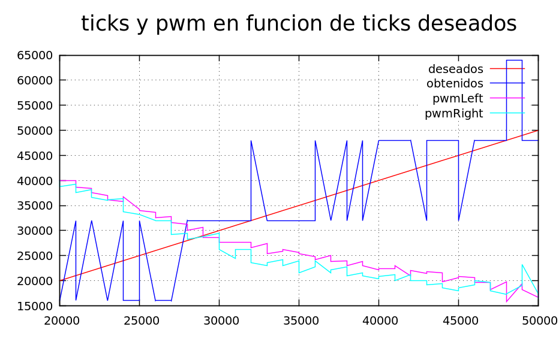

Hemos decidido parar un poco la programación, que se estaba volviendo un
poco caótica, y buscar una herramienta para visualizar de forma gráfica
los datos muestreados en el funcionamiento del robot, para tomar
decisiones algo más informadas y no lanzarse a probar cosas a lo loco.

Encontramos `gnuplot`, una herramienta muy sencilla de empezar a utilizar
aunque con muchas posibilidades para un uso más avanzado.

[Página oficial gnuplot](http://www.gnuplot.info)

Nosotros la instalamos desde el repositorio oficial de nuestra distribución,
aunque en la web también están disponibles los binarios y el código fuente.

## Uso básico

`gnuplot` es un programa interactivo, aunque aquí lo vamos a usar preparando
previamente un fichero de comandos sencillo en el que especificaremos el 
nombre de los ejes, etiquetas para las distintas líneas mostradas, títulos...

Hemos preparado un pequeño script _tipo_, que esperemos nos sirva para
visualizar la mayoría de los casos.

```
$ cat docs/plots/plantilla.gp
set title "Ejemplo de uso de gnuplot"

#set style data line
set style data linespoints

# Define un rango para los ejes (por defecto, automático)
# set xrange [0:50]
# set yrange [0:50]

set xlabel "eje x"
set ylabel "eje y"

# muestra una rejilla
set grid

# obtiene los titulos de las columnas del fichero de datos
set key autotitle columnhead

# para mostrar nombres de colores: show palette colornames
plot 'datos.dat' using 1:2 linecolor "red"
replot 'datos.dat' using 1:3 linecolor "blue"
replot 'datos.dat' using 1:4 linecolor "magenta"
replot 'datos.dat' using 2:4 linecolor "magenta"

# Espera a que se pulse una tecla
pause mouse keypress
```

Hemos dejado alguna línea comentada como referencia, por si en el futuro
queremos cambiar el tipo de línea o establecer un rango fijo de datos en
los ejes.

Ahora deberemos cambiar los Serial.print() de nuestro sketch para que
simplemente muestre los números separados por espacios. Anadimos una línea en el setup
para que muestre los nombres de los datos (y así utilizar el etiquetado automatico
del `gnuplot` y redirigir la salida a un fichero. Debemos eliminar las primeras líneas
en las que se muestra el estado de la batería y el registro OCR1A antes de llamar a
gnuplot..

```
$ gnuplot docs/plots/ejemplo.dat
```

Después de cambiar algunos titulos, y escalar los valores de pwm (ya que son muy
inferiores a los valores de ticks y no se apreciaban en el gráfico sin hacer zoom)
obtenemos algo como esto:



Ya vemos a primera vista algo que no nos encaja... pero no nos dispersemos. Por el
momento creamos una carpeta `docs/plots` en el branch principal en el que iremos
dejando tanto los ficheros `.gp` como los ficheros de datos que obtengamos.

## Funciones de log

Nos gustaría disponer de ciertas funciones que logeen datos de una forma
predeterminada para, en cualquier punto del desarrollo, poder modificar el
sketch fácilmente y mostrar información por el puerto serie preparada
para visualizar con `gnuplot`. 

Por ahora empezaremos creando una función de log en `encoders.cpp`, que
únicamente se compilará si se está definido en el preprocesador la
constante ENCODERS_LOG_ESTADO. En el bucle principal pondremos la llamada
a esa función condicionada también a la existencia de esa constante.

Veremos sobre la marcha cómo vamos escalando a medida que aparezcan distintos tipos de
datos que mostrar visualmente.

## Nuevo _environment_ en platformio.ini

Para compilar el sketch con la opción de debug sin tener que modificar
el fuente, anadimos un nuevo entorno a platformio.ino

```
[platformio]
env_default = nanoatmega328

[common_env_data]

[env:nanoatmega328]
  platform = atmelavr
  board = nanoatmega328
  framework = arduino
  monitor_speed = 115200

[env:debug]
  platform = atmelavr
  board = nanoatmega328
  framework = arduino
  monitor_speed = 115200
  build_flags =
    -D ENCODERS_LOG_ESTADO=1

```

Así, para compilar con la esa opción activa, simplemente tendremos que hacer
`pio run -e debug`.

commit: a5c581d19be0cb4e812266c7a6f53379e199df41
