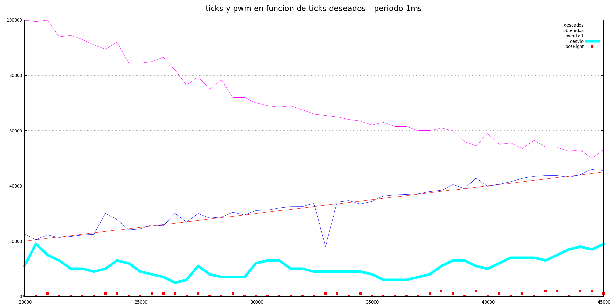
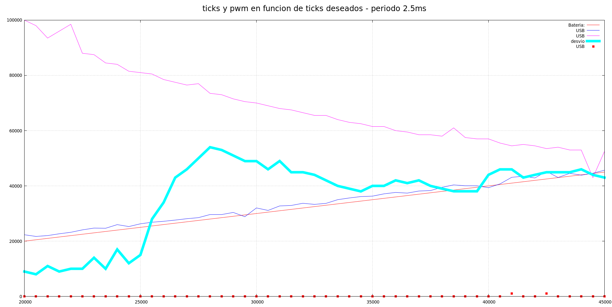
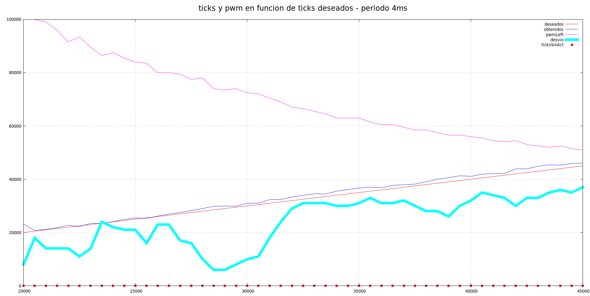

Vamos a dedicar un tiempo a hacer distintas pruebas con gráficas, sin
ningún rumbo fijo, e intentar comprobar si el pid se comporta como debiera.

# Error en encoder_ISR_right

Según se nos presentó el gráfico de ayer, nos dimos cuenta que los ticks obtenidos
eran múltimplos de OCR1A, como si siempre se nos disparara el caso 3. Sin embargo,
habíamos visto en pruebas previas que el caso 2 es bastante habitual, sobre todo
a "altas" velocidades. En un vistazo rápido a `encoders.cpp` vemos que nos habíamos
olvidado de actualizar el buffer encargado de obtener la diferencia en la interrupción
del encoder derecho, justo el que logeábamos. Al ser siempre
0 dicha diferencha, el cálculo de ticks en el caso 2 no se hacía correctamente.

Corregimos el fallo, miramos la gráfica del resultado y, efectivamente, ahora los
ticks obtenodidos siguen una trayectoria mucho más lineal, sin tantos saltos bruscos

# Comprobación del desvío

Queremos comprobar cuánto se desvía el robot sin ningún control de la velocidad angular.
Decidimos introducir dos nuevas variables de posición en el fichero `encoder.cpp`, de
manera que las anteriores `encoder_posicion` serán una especie de _cuentakilómetros parcial_, que 
se encarga de resetear el timer, y la otra acumula el total de la posición. En principio, sólo
hacemos esto para logear, pero sospechamos que nos va a ser útil con el proyecto más avanzado.

En `gnuplot` podemos obtener nuevos datos basados en cálculos de los ficheros de entrada: introducimos
una línea  que nos mostrará la diferencia de este contador total, es decir, cuánto más está girando
una rueda con respecto la otra.
```
plot 'data.dat' using 1:(($5-$6) * 1 + 1000) linecolor "salmon"
```

Detectamos dos cosas: en general, la posición de ambas ruedas se mantiene durante bastante tiempo
con pequeñas variaciones entre muestra y muestra de unos 5-10 pasos. Pero la primera muestra sí
que tiene una gran desfase de unos 75 pasos y alrededor de los 50000 ticks una variación aún peor
de más de 500 pasos en 200 milisegundos.

Hacemos otra prueba únicamente entre 45000 y 55000 y vemos que efectivamente los valores empiezan
a distorsionar bastante alrededor de 47000. En este momento, siempre estamos usando el caso 3 (
que realmente _estima_ la velocidad por falta de información). Parece lógico.

# Pruebas con distinto periodo

Nos gustaba el periodo de 1 ms, pero estamos viendo que para la resolución del encoder 
es demasiado rápida. Hicimos unas cuantas pruebas con periodos distintos, y el control de la velocidad a priori, parece mejor,
ya que nos entra casi siempre en el caso 1 y se supone que debería ser bastante exacto.

Aquí dejamos unas muestras:







Hay muchas cosas que estudiar:

- Tenemos que intentar mejorar el parámetro Kp del pid. No nos gusta mucho que en la mayoría de
los casos los ticks obtenidos estén por encima de los deseados. Debería estar alternando.

- Hay que experimentar de nuevo con disparar los encoders en modo CHANGE, teniendo en cuenta
las características de nuestros motores que hacen que esté más tiempo en modo HIGH que en LOW. Incluso
quizá, al ser alternativos, el pid sea capaz de absorber esta varianza.

- Hay que conseguir que el robot se mueva recto, así que tenemos que introducir
la velocidad angular en el cálculo. Parece ser especialmente problemático en el momento de arranque.

- Hay que hacer distintas pruebas saltando de velocidades bruscamente, no sólo de forma creciente: nos
hace falta para estudiar la convergencia del pid y afinar el parámetro Kp.

- Hay que buscar un compromiso con la frecuencia del timer, ya que 1ms creemos que, claramente,
no es conveniente dadas las características de nuestro encoder. Por el momento lo dejamos en 4ms.
