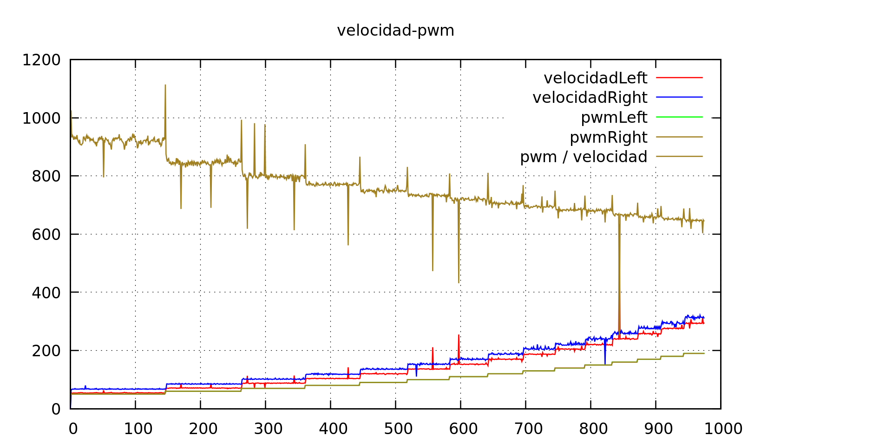

Hemos decidido buscar una manera mejor de controlar la velocidad, y de paso,
rediseñar los algoritmos del encoder (los famosos casos 1, 2 y 3) que se antojan
algo complicados y no parecen seguir el principio KISS.

# Otra manera de medir la velocidad

En la ISR del encoder, además de actualizar los contadores, guardaremos en una
variable `ultimo_tcnt1_left` (o right) el valor de TCNT1. Este valor se reescribe si se vuelve a disparar el
encoder antes de una interrupción de reloj.

En la interrupción de reloj calculamos la velocidad de cada rueda (en m/s): los metros recorridos se calculan
en función de la longitud de paso del encoder y los saltos que haya pegado dicho encoder desde la anterior
interrupción. Mantenemos la variable `ticks_sin_actualizar`, que se incrementa cuando no hay saltos de
encoder en un periodo completo de interrupción (y se resetea cuando sí lo hay). Así que el tiempo será:
 
```cpp
tiempo = PERIODO_TIMER * 
            (
                OCR1A * (ticks_sin_actualizar_left + 1) +
                ultimo_tcnt1_left -
                tcnt1_anterior_left
            )
          / 
          OCR1A 
```

... y cada vez que hagamos esta cálculo, guardamos en `tcnt1_anterior_left` el valor del ultimo tcnt1.

Creo que este cálculo es más claro, elimina la diferencia entre caso 1 y caso 2 y, en el caso 3, cuando
no hay actualizaciones del encoder, directamente estableceremos la velocidad a una constante que indica
VELOCIDAD_INDEFINIDA. De esta manera, en el futuro cálculo de pwm del PID nos saltaremos la actualización
si no hay información. Aun hará falta experimentar con esto pero en principio parece una idea mejor.

# Prueba de los cálculos

Hacemos una prueba aplicando distintas pwms y obtenemos la siguiente gráfica. Anadimos en el `.gp` la
relación entre el pwm y la velocidad: se ve que no es lineal, sino que a pwm altos, el mismo incremento
de pwm resulta en un incremento mayor de la velocidad.



Se ven además unos picos aleatorios en los cálculos. Tendremos que ver si podemos eliminar ese ruido (que es significativamente
grande)
