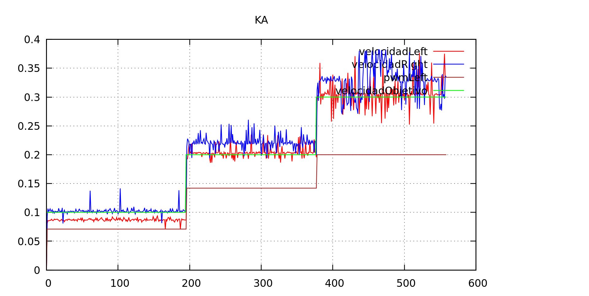

Estuvimos leyendo los excelentes [posts](http://brettbeauregard.com/blog/2011/04/improving-the-beginners-pid-introduction/)
del creador de la libreria [Arduino PID library](http://playground.arduino.cc/Code/PIDLibrary), y estamos pensando en
rededefinir el PID de nuevo.

De todas formas, tenemos que conseguir medir la velocidad de forma exacta y se nos está resistiendo. Encontramos unos
picos en los cálculos que vienen de un viejo problema que ya nos habíamos encontrado: la interrupción de tiempo parece
no dispararse en TCNT1 == 0, sino que se da el caso de que el contador se ha reiniciado, se ejecuta la ISR del encoder
(guardando un valor en `ultimo_tcnt1` muy pequeño, y la siguiente vez que se ejecuta el timer es como si se saltara
un 'tick', dando un valor de velocidad mucho más grande que el real. Hemos filtrado con una simple comparación, aunque
hay que encontrar un modo mejor.

# Parte proporcional a la entrada

Al principio habíamos definido el PID para que devolviera _el incremento_ de pwm que teníamos que aplicar en función
del error (velocidad obtenida - velocidad deseada). Después introdujimos la parte integral y el algoritmo se volvió
errático: luego decidimos hacer un PID clásico, en el que el output sería el pwm directamente, siendo el error igualmente
la diferencia de velocidades obtenida/deseada.

Sigue sin gustarnos este enfoque: un PID controlando el pwm de un motor necesitará la parte integral obligatoriamente,
ya que el error obtenido no aporta información relevante. Por ejemplo: si tenemos el pwm a 100, y nos estamos moviendo
a 0.15 m/s, si la velocidad objetivo cambia a 0.30, el error es exactamente el mismo que si estamos parados y queremos
arrancar a 0.15 m/s. Pero evidentemente el pwm que hará que el sistema esté estacionario es otro.

Aún a riesgo de intentar complicar un algoritmo que sabemos que es bien conocido y que está funcionando en miles
de sistemas en todo el mundo, dando que nosotros tenemos cierta información sobre el comportamiento del sistema podemos
introducir algunas fórmulas que van a "ayudar" a la convergencia del PID.

Para empezar, sabemos que la velocidad alcanzada por un pwm concreto es casi proporcional a ese pwm, así que nuestra
salida del PID va a tener una componente proporcional a la entrada. Llamamos a esa constante KA. Sabemos (de forma
empírica, que aproximadamente con un pwm de 200 obtenemos una velocidad de 0.28 m/s), así que definimos KA como:

```
#define KA (200 / 0.28)
```

Simplemente cone ste valor, obtenemos la siguiente gráfica.



Nos interesa que en una primera componente el sistema se aproxime al pwm que estabiliza, y comprobar el cálculo de
velocidades. Vemos que a medida que aumenta la velocidad, aumenta el ruido en el cálculo. Tenemos que seguir
investigando sobre esto.

commit: 789949f60914809cf79a33322e51beb967b04a55
