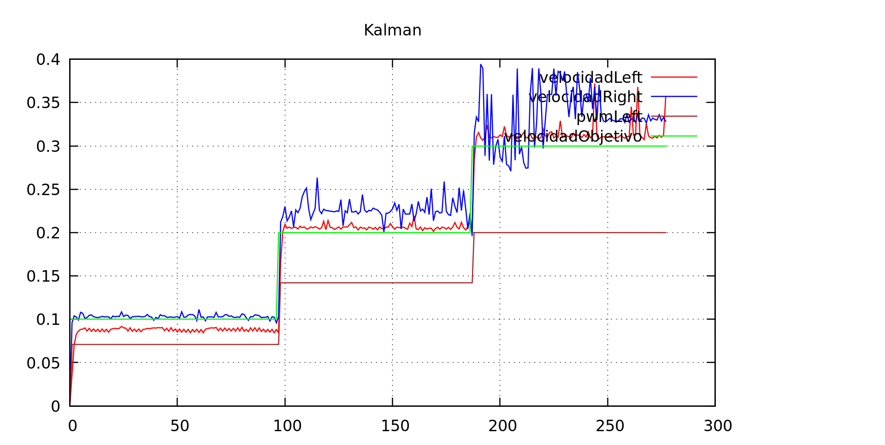
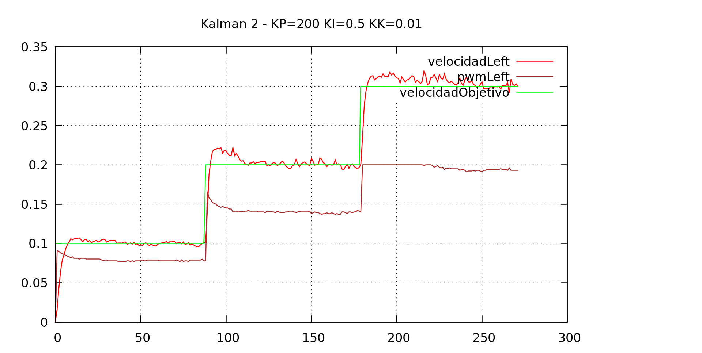

Ya hemos visto que la velocidad calculada por los encoders no es todo lo precisa que nos gustaría. Vamos
a probar un (filtro Kalman)[https://en.wikipedia.org/wiki/Kalman_filter] simple para "suavizar" el resultado.
Somos conscientes de que aplicando el filtro estamos alimentando al PID con valores erróneos... pero vamos
a probar igualmente.

# Prueba con Kk = 0.05

Probamos con varios valores de ganancia, y en una prueba preeliminar, un valor de 0.05 parece converger
bastante rápido. Para ver la diferencia, implementamos el filtro únicamente en el encoder izquierdo.

La diferencia entre la velocidad filtrada (izquierda) y la otra salta a la vista.

# Demasiados parámetros?

Estamos experimentando con distintos valores de KP, KI, la ganancia de Kalman... y lógicamente unos cambios
en un parámetro afecta a los otros: si hacemos la ganancia Kalman muy pequeña, la velocidad "real" tarda en aparecer en la entrada
del pid, con lo cual se debe aumentar KP y KI... y viceversa. De todos modos, nos gusta bastante que el
valor de pwm aparece bastante plano, apareciendo un pico inicial cuando la velocidad objetivo sube (lo cual,
además es lógico porque para llegar rápidamente a esa velocidad hay que aplicar un pwm algo mayor de el que
se requiere para mantenerla.

Creemos que podemos estar en el camino correcto. Como en la aplicación real el robot va a estar constantemente
acelerando y frenando, habrá que re-revisitar estas parametrizaciones, cuando pongamos los sensores infrarrojos
y nos movamos por un laberinto de verdad.

