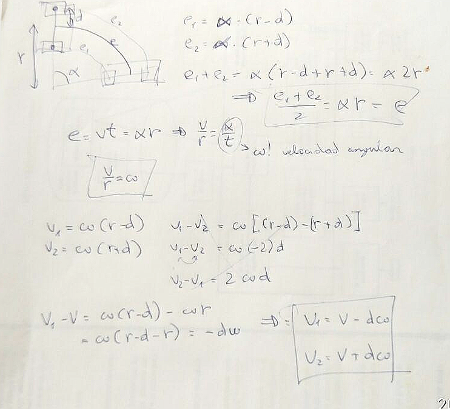

Ahora que ya tenemos los cálculos en unidades internacionales vamos a introducir
la velocidad angular en la funcion `motores_actualizar_velocidad`.

En un movimiento circular, según nuestros cálculos, dada una velocidad "general" (la que
seguiría el punto medio del robot), tendremos que aumentar o disminuir la velocidad de cada rueda
según la ecuación `v1 = v - dw` y `v2 = v + dw`, siendo *v* la velocidad lineal, *d* la distancia
del punto medio a la rueda, y *w* la velocidad angular en radianes por segundo.



Lo que haremos será variar el cálculo del error de velocidad en cada uno de los motores para
que incorpor esta relación.

```cpp
void motores_actualizar_velocidad() {

    error_lineal_left = encoders_get_ultima_velocidad_left() - 
       (velocidad_lineal_objetivo + (velocidad_angular_objetivo * DISTANCIA_ENTRE_EJES / 2  ));
    error_lineal_right = encoders_get_ultima_velocidad_right() -
       (velocidad_lineal_objetivo - (velocidad_angular_objetivo * DISTANCIA_ENTRE_EJES / 2  ));
```

# Prueba de concepto

Como la velocidad angular es la velocidad lineal dividido por el radio, utilizamos esta relación
para hacer que el robot haga unos círculos de 20cm, a distintas velocidades.

```cpp
motores_set_velocidad(speed, speed / 0.20);
```

El robot efectivamente gira en un radio aproximado de 0.20, aunque la _repetibilidad_ no es buena.
Puede que tengamos un error en nuestras ecuaciones, pero ahora mismo no encontramos ninguno. Y
lo que nos parece más probable es que las ruedas, al ser tan anchas, apoyen en distintos sitios
a lo largo de la trayectoria variando la constante _DISTANCIA-ENTRE-EJES_. Parece que va a 
existir un compromiso entre ruedas anchas (aumentando la adherencia y por lo tanto las velocidades
máximas) o estrechas (mejorando la presición de los movimientos).

Nos pelearemos con esto más adelante.
