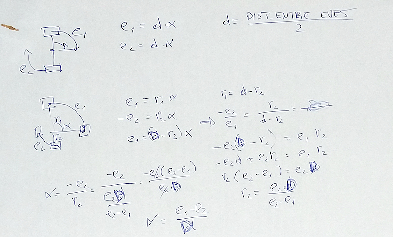

Ya conseguimos mover el robot en línea recta y también con una velocidad angular
determinada. A ver si conseguimos hacerlo girar sobre si mismo un número determinado
de grados.

Este movimiento es importante a la hora de la exploración del laberinto. Hay que
realizarlo cuando se llega a un callejón sin salida. En
la fase de resolución nos gustaría que el robot nunca girara sobre si mismo, haciendo
las curvas de la manera más suave posible, pero estamos muy lejos de eso. Por el momento,
vamos a girar sin movernos del sitio.

# Controlando el ángulo de giro

Un giro sobre sí mismo (es decir, sobre el centro del eje de las ruedas), se consigue
directamente con un `motor_set_velocidad(0, velocidad_angular)`. Es decir: la velocidad
lineal es 0 y la velocidad angular hace que una rueda vaya hacia adelante y otra hacia
atrás (teóricamente a la misma velocidad).

Para saber cuándo parar, necesitamos controlar en qué angulo relativo estamos con respecto
al inicio del movimiento. 



Creamos unas variables `aux_e1` y `aux_e2` para agilizar los cálculos (y evitar la creación
dinámica de las variables en cada ejecución de la interrupción) Según nuestros cálculos,
teniendo en cuenta que en este movimiento los signos son inversos, el código quedaría así:

```cpp
aux_e1 = encoders_get_ultima_velocidad_left() * PERIODO_TIMER;
aux_e2 = encoders_get_ultima_velocidad_right() * PERIODO_TIMER;

angulo_actual_calculado += (aux_e1-aux_e2) / DISTANCIA_ENTRE_EJES;
```

# Probando el código

Lanzamos una prueba intentando que el robot gire sobre si mismo 180 grados. Se pasa de largo
unos 15 grados.

- Compilamos sin la opción de debug, para evitar la espera de 100 ms antes de la
siguiente comprobación del ángulo. Algo mejora, pero sigue pasándose de largo.

- Introducimos una pequeña desaceleración en el `loop()` cuando nos acercamos al objetivo, pero
no parece imfluir mucho.

Tendremos que hacer más pruebas con gráficos. No entendemos porqué esa variación tan grande. Sabemos
que los cálculos no son muy precisos pero confiábamos que sucesivos errores pequeños se anularan
unos a otros. Está claro que no es así.

commit: 758633a51c892b12b55160fb6dcfb4718d9c0df5
