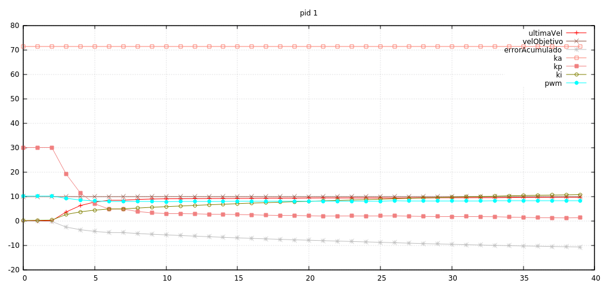

Disclaimer: no lo conseguimos hacer. Tenemos serias dudas de que el arduino
sea físicamente capaz de transmitir varias variables en tiempo real a 115200 baudios,
así que lo que hicimos fue hacer un nuevo entorno `pid_debug`, y si la constante
correspondiente está activa, la función `motores_set_velocidad` llama a una rutina
que va guardando en un buffer los valores que queremos loguear y, cuando se llena,
imprime todo el array por el puerto serie

# Problemas de memoria

Estuvimos un buen rato pensando porqué no se movían los motores al cargar el sketch.
Hasta que vimos un _pequeño_ detalle.

```
Linking .pioenvs/debug_pid/firmware.elf
Building .pioenvs/debug_pid/firmware.hex
Checking size .pioenvs/debug_pid/firmware.elf
Memory Usage -> http://bit.ly/pio-memory-usage
DATA:    [==========]  323.3% (used 6622 bytes from 2048 bytes)
PROGRAM: [===       ]  33.2% (used 10196 bytes from 30720 bytes)
```

Efectivamente. Usamos un 323.3% de la memoria disponible, y no sabemos muy bien qué se
subía al arduino pero no funcionaba. Tuvimos que reducir considerablemente el tamaño del
array de las distintas variables que logeamos.

# Muchos ticks sin actualizar

El primer resultado que vimos es que la velocidad obtenida era la misma en varias lineas
seguidas, indicador de que `ticks_sin_actualizar` era muy bajo. Aumentamos el periodo
a 4 ms, el último número redondo que nos cabe en _Timer1_ sin preescalado.

# Pid muy lento

Como tuvimos que rebajar el muestreo a 40 muestras, la velocidad obtenida ni siquiera
se acercaba al objetivo antes de llenarse el buffer. Como nos interesaba logear el
comportamiento del pid completo hasta pasado el primer _overshot_, introducimos un
control en el logueo, de manera que se hace una vez cada 20 pasos de encoder.



Algunas variables están escaladas para que no quedaran demasiado planas en el gráfico. Pero
la idea se ve claramente: el valor Ka es el que más aporta al pid y lo demás no parece marcar
mucha diferencia.

Decidimos poner KI a 0 para encontrar un KP adecuado, y lo curioso es que por mucho que subamos
KP no llega a superar la velocidad objetivo.

No podemos seguir, pero aunque (de nuevo) el commit de hoy está un poco sucio (debido a que 
tampoco sabemos muy bien que queremos hacer), parece que hay una buena base para estudiar
el comportamiento del pid.

commit: fb0da48067ecf2a12eadecb2fa8c17e63a9dd970
