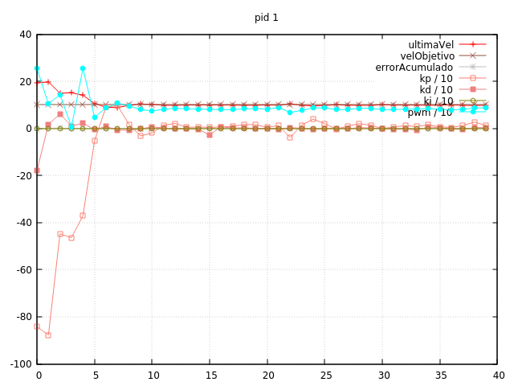

Hoy estuvimos experimentando con el PID, y esta es la historia resumida:

- Empezamos eliminando el filtro de Kalman (ponemos la constante a 1) para tener
en cuenta exactamente la velocidad que obtenemos del encoder. Lanzamos una prueba
y la velocidad real nunca sobrepasa la deseada, así que aumentamos Kp.

- Con Kp 1100 ya empezamos a tener una ligera oscilación entre el punto deseado, pero
sigue estando principalmente por debajo. Eliminamos del gráfico la línea de Ka y
seguimos subiendo Kp. Hay que subir hasta 6500 para obtener un resultado que nos
parece decente.

- Con este valor de Kp intentamos subir Ki para conseguir que al final se alcance
la velocidad objetivo. No conseguimos más que aumentar el balanceo, lo cual parece
lógico ya que la integral acumulada cuando el pid supera el punto deseado mantiene
un pwm excedido... Intentamos utilizar únicamente el último error, en vez de
acumularlo continuamente.

- Sigue sin convencernos. Decidimos eliminar la constante Ka y volver al esquema que
utilizamos al principio: usar el pid para estimar el incremento/decremento del
pwm. Con Kp entre 300 y 400 el resultado parece converger (aunque oscilando).

- Para intentar evitar las oscilaciones, introducimos Kd. A partir de 3.0 se empieza
a eliminar el overshot, pero un buen valor parece Kd = 7. Sin embargo, volvemos a la
situación en la que la velocidad real siempre está por debajo de la deseada.

- A partir de 900 de Kp, vemos que alguna vez se supera la velocidad deseada. Así que
vamos a ir incrementando Ki hasta conseguir lo mismo pero sin el overshot inicial. Encontramos
que el sistema es bastante sensible con Kd entre 7.1 y 7.2 (lo cual nos parece bastante
poco margen). Lo dejamos en 7.14, dándonos a veces overshot y a veces no.

- Ya estamos en condiciones de logear en memoria cada ciclo de reloj, para estudiar
más detenidamente el comportamiento. Por ahora estamos así:

```cpp
#define KP_LINEAL -900.0
#define KD_LINEAL -7.14
#define KI_LINEAL -0

#define PERIODO_TIMER 0.004
```


Como vemos, tarda unos 5-6 ciclos en alcancarse la velocidad deseada, a 4ms por ciclo,
20 ms. Nos gustaría que fuera menos, pero si aumentamos Kp el sistema es muy difícil
de volver a calibrar...

- Intentamos rebajar el periodo del timer, a 2 ms. Las constantes parecen cambiar completamente

- Ya puestos, cambiamos el modo de disparo del encoder a CHANGE. Mucho peor. Al reportar 
velocidades alternadas a cada variable, la constante proporcional varía demasiado y no se
puede controlar con la Kd (estos cambios son equivalemte a _ruido_, y la derivada es muy
sensible a esto).

# Primera conclusión

Por ir cerrando cosas pendientes, vamos a establecer el perido en 4ms, el modo del 
encoder en RISING, y las constantes que especificamos antes. Sabemos que
es muy malo (muy lento). Esperemos que sea suficiente, dado que nuestro robot ya va a ser
lento de por si.


# Cambios de velocidad

Queremos comprobar cómo se comporta el pid cuando se cambia de una velocidad a otra. Simplemente
ponemos el robot a 0.10 m/s, esperamos un poco, activamos el logueo y lo ponemos a 0.20. Los
valores anteriores se comportan bien, aunque a veces el sistema se descontrola unos pocos ms,
volviendo a estabilizarse.


Asumimos esos fallos temporales. Ahora comprobamos una deceleración de 0.20 a 0.10



Como vemos, también parece que se comporta bien, estabilizándose a la nueva velocidad en 7 ciclos (28 ms)

# Un pequeño bug en la asignación de pwm

Hacemos la prueba que dejamos ayer (siempre desde el USB) y se ve claramente que en el momento del giro,
una rueda mucho más rápidamente que otra. Parece increíble que no diéramos con este bug antes, pero para
que funcione la acumulación de pwm en el control del pid, es necesario que el signo de las variables `pwm_` sea
congruente con la dirección, y nosotros siempre lo guardábamos en positivo.

# Prueba en _real_ con el robot en el suelo

Todas estas calibraciones las hemos hecho conectados al USB. Y nos dimos cuenta que ha sido un error. Al
conectar las baterías (que además tenemos recién cargadas, cerca de los 8v) el robot empieza a moverse a saltos
lentamente. Mañana tocará hacer lo mismo que hoy, pero esta vez, logeando a través de bluetooth.
