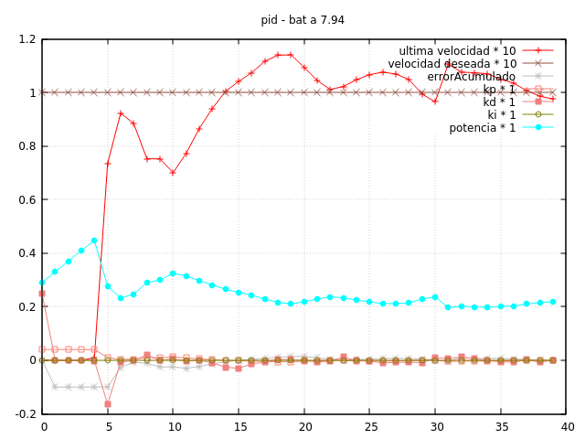

Creemos que el problema de ayer es debido a que estamos proporcionando mucha
más potencia al motor con el mismo valor de pwm, al llegarle la corriente directamente
de la batería. La solución más elegante parece que es crear etapa de alimentación
para los motores, con un voltaje constante. Pero somos demasiado perezosos ahora mismo
para diseñarla. Intentaremos normalizar el pwm en función de la carga.

# Márgenes de pwm en función de la carga

Aunque depuremos muchas veces conectados al USB (por comodidad), los valores deberán
estar optimizados para su uso con batería. La carga de la LiPo de 2 celdas no debería
bajar de los 7.2v (no encontramos un consenso, pero vamos a poner este valor que aún
tiene márgen de seguridad). Como los motores son de 6v (y no queremos forzarlos), el
pwm máximo para esta carga será:
```
pwm_paximo = 255 * 6 / 7.2 = 212
```

De forma análoga, con carga completa de la batería (unos 8,4 v)

```
pwm_paximo = 255 * 6 / 8.4 = 182
```

# Cambio de llamada a `motores_set_pwm`

Cuando se agusta la velocidad en la interrupción, el pid nos tiene que devolver un
valor de potencia (por ejemplo de 0 a 1), que normalizaremos entre los valores de
0 y el pwm_maximo. La constante de preprocesador MAX_PWM pasa a ser una variable
volátil.

```cpp
void motores_set_potencia(float left, float right) {
    motores_set_pwm_left((int) left * max_pwm);
    motores_set_pwm_right((int) right* max_pwm);
}
```

Ya solo falta refactorizar las llamadas a `motores_set_pwm` y las variables implicadas:
ya no usamos las `volatile int16_t pwm_*`, si no `volatile float potencia_*`. Dejamos
igualmente los getters para hacer unas cuantas trazas y asegurarnos sque todo va bien.

# Configurar `pwm_maximo`

La funcion `motores_init()` ahora necesita como parámetro el voltaje de la batería
en `motores.cpp`

```cpp
motores_set_pwm_maximo(255.0 * 6.0 / bateria_voltaje());
```

# Calibrando por bluetooth

Empezamos a calibrar (otra vez) nuestro nuevo PID. Empezamos por USB para encontrar un
valor inicial de Kp. Al cambiar las unidades de salida del PID, Kp cambia y decidimos
empezar a depurar por bluetooth partiendo de Kp = 0.4.

- No se comporta mal. Hay un ligero overshot pero converge (comprobado después de cambiar
la frecuencia de logueo a una vez cada 8 actualizaciones.

- Subimos Kd hasta 0.01, pero la derivada interviene agresivamente, parando la subida
a la velocidad deseada.

Seguimos probando varias posibilidades pero vamos a recapitular un poco. Aunque es relativamente
cómodo subir los sketch por bluetooth, el procedimiento es algo tedioso. Tenemos que darle al
reset y ejecutar el comando `pio upload` con un timing preciso, para que no de error. Normalmente
lo conseguimos pero a veces necesitamos varios intentos... Lo ideal sería poder introducir
parámetros por el puerto serie. Ahorraremos mucho tiempo.

Dejamos una imagen del punto en que nos quedamos y cuando tengamos lista la introducción de
parámetros por puerto serie, retomamos la calibración



commit: c1cc5ffbe5dd7a20c7db6dbbb61feb5c7a284a33
