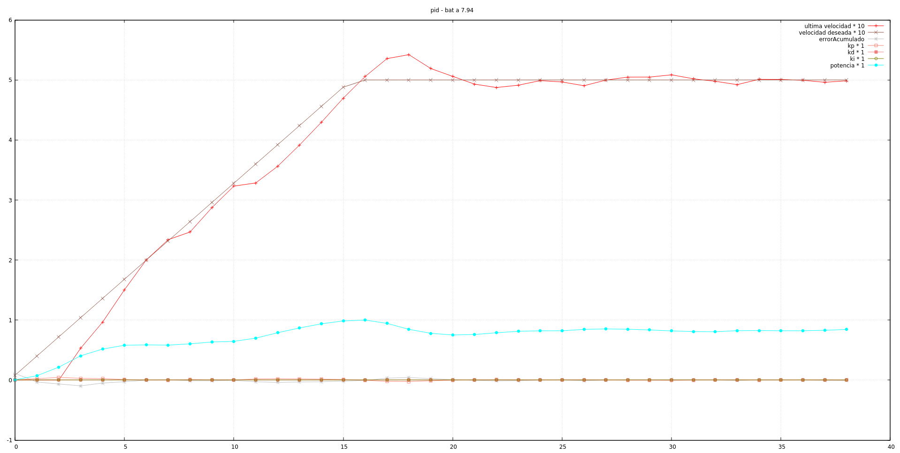
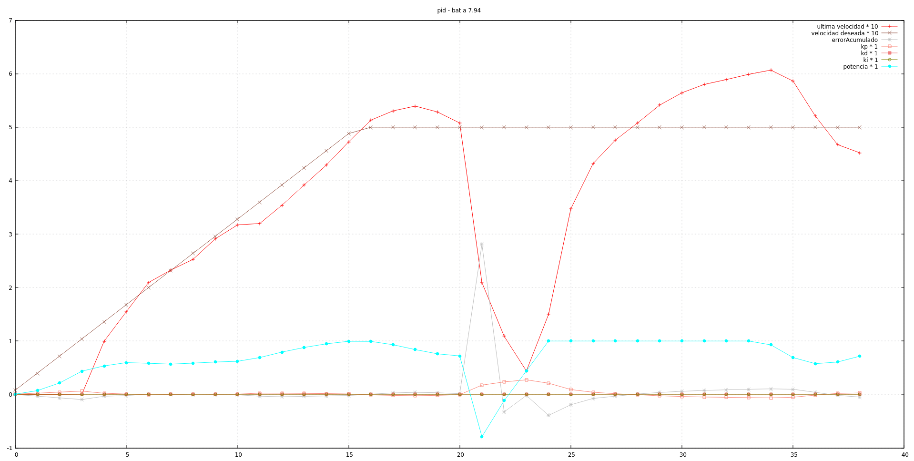

Ahora que parece que está lista nueva manera de controlar la potencia de pwm, teniendo en cuenta
la carga de la batería, vamos a encontrar la velocidad máxima y la aceleración que podemos
conseguir. Ya habíamos programado la aceleración hace unos días, pero con unidades no estándar y
resultaba muy confusa. Esperamos que con las unidades internacionales resulte mucho más fácil.

# Velocidad máxima

Tenemos la bateria casi cargada a tope, dándo una lectura de 8.12 v. Lo que trataremos de hacer
es encontrar una velocidad en la que el motor más "débil" esté cercano al pwm máximo calculado 
(dejando algún margen para que la corrección del pid funcione). Definimos el comando `vm` para
lanzar un setter de esta velocidad y evitar recompilaciones.

Después de algunas pruebas, y con la batería reportando 8.02 v, podemos alcanzar los 0.60 m/s
algo apretados (varias lecturas devuelven 1.00 de potencia). Así que lo vamos a dejar en 0.50 
que es un número redondo. Aunque sea lento para un robot de competición seguro que es lo suficientemente
rápido para encontrarnos más de una dificultad al moverse por el laberinto.

# Aceleración

Volvemos a encontrarnos el "caballito", que se produce al intentar pasar directamente de 0 a 1
de potencia sin ningun control de aceleración.

Lo que haremos es mantener na variable `max_velocidad_lineal_objetivo_temp`,
que es la que contiene la velocidad instantánea que queremos alcanzar con el pid (en esa misma
interrupción del reloj). Esta velocidad, se irá incrementando a cada interrupción
de reloj según la constante `maxima_aceleracion_lineal`. También creamos el comando `am` para
setearla.

Con una aceleración de 3 m/ss ya percibimos el "caballito", y con 2 m/ss la aceleración nos parece
bastante buena. No vamos a dedicarle más tiempo. Creemos que esta aceleración es más que suficiente.
De hecho, _bulebule_ acelera menos, lo que nos hace dudar de nuestros cálculos un poco... un día
lo comprobaremos con las ecuaciones de cinemática en la mano, pero hoy no.

# Mas PID

Ya comienza a cansarnos un poco :). Hemos tenido que desactivar Ki y Kd para las pruebas anteriores:
al cambiar la velocidad máxima esas constantes no funcionaban, y aunque el sistema converge, parece
que se puede mejorar bastante el comportamiento.

Hasta ahora, cuando logeábamos en memoria, si queríamos muestrear "de vez en cuando", consultábamos 
los saltos de encoder: cada _x_ saltos grabábamos un log. Eso hace que las gráficas no sean lineales
en el tiempo, sino que dependen de la velocidad. Introducimos una variable `cuenta` en el timer,
que incrementaremos en cada ejecución de la interrupción, y podemos consultar para logear cada _x_
saltos de timer.

Ahora las gráfica tiene algo más de sentido. Curiosamente, únicamente con Kp a 0.6 (las demás constantes
a 0) obtenemos una gráfica bastante buena, como esta:



Seguro que se puede mejorar, pero lo vamos a dar por bueno. El problema es que algunas veces, con los
mismos parámetros, aparecen cosas como esta:



La potencia a los motores llega a ser negativa, lo que indica que en algún momento la velocidad reportada
debió de ser muy superior a la real. Aumentamos la granuralidad del log a cada salto de interrupción y
hacemos varias pruebas a ver si conseguimos fotografiar ese momento.

```
ultimaVel velObjetivo errorLeft errorAcumulado kp kd ki potencia encoderPos
0.18317 0.50000 -0.31683 -0.26338 0.19010 0.00000 0.00000 -0.53137 1
0.10973 0.50000 -0.39027 -0.31683 0.23416 0.00000 0.00000 -0.29720 1
0.49747 0.50000 -0.00253 -0.39027 0.00152 0.00000 0.00000 -0.29569 0
0.49599 0.50000 -0.00401 -0.00253 0.00241 0.00000 0.00000 -0.29328 0
0.02530 0.50000 -0.47470 -0.00401 0.28482 0.00000 0.00000 -0.00846 1
0.50232 0.50000 0.00232 -0.47470 -0.00139 0.00000 0.00000 -0.00985 0
0.50543 0.50000 0.00543 0.00232 -0.00326 0.00000 0.00000 -0.01311 0
0.50542 0.50000 0.00542 0.00543 -0.00325 0.00000 0.00000 -0.01636 0
0.50805 0.50000 0.00805 0.00542 -0.00483 0.00000 0.00000 -0.02119 0
0.50894 0.50000 0.00894 0.00805 -0.00536 0.00000 0.00000 -0.02655 0
0.50621 0.50000 0.00621 0.00894 -0.00372 0.00000 0.00000 -0.03028 0
0.50460 0.50000 0.00460 0.00621 -0.00276 0.00000 0.00000 -0.03304 0
0.50668 0.50000 0.00668 0.00460 -0.00401 0.00000 0.00000 -0.03704 0
0.50358 0.50000 0.00358 0.00668 -0.00215 0.00000 0.00000 -0.03919 0
0.00000 0.50000 -0.50000 0.00358 0.30000 0.00000 0.00000 0.26081 0
0.00000 0.50000 -0.50000 -0.50000 0.30000 0.00000 0.00000 0.56081 0
0.00000 0.50000 -0.50000 -0.50000 0.30000 0.00000 0.00000 0.86081 0
0.00771 0.50000 -0.49229 -0.50000 0.29538 0.00000 0.00000 1.00000 1
0.11130 0.50000 -0.38870 -0.49229 0.23322 0.00000 0.00000 1.00000 1
0.18127 0.50000 -0.31873 -0.38870 0.19124 0.00000 0.00000 1.00000 3
0.24355 0.50000 -0.25645 -0.31873 0.15387 0.00000 0.00000 1.00000 2
0.28297 0.50000 -0.21703 -0.25645 0.13022 0.00000 0.00000 1.00000 3
0.31721 0.50000 -0.18279 -0.21703 0.10967 0.00000 0.00000 1.00000 3
0.33913 0.50000 -0.16087 -0.18279 0.09652 0.00000 0.00000 1.00000 4
0.36495 0.50000 -0.13505 -0.16087 0.08103 0.00000 0.00000 1.00000 4
0.38594 0.50000 -0.11406 -0.13505 0.06844 0.00000 0.00000 1.00000 4
0.40585 0.50000 -0.09415 -0.11406 0.05649 0.00000 0.00000 1.00000 4
0.41404 0.50000 -0.08596 -0.09415 0.05158 0.00000 0.00000 1.00000 4
0.41793 0.50000 -0.08207 -0.08596 0.04924 0.00000 0.00000 1.00000 5
0.43857 0.50000 -0.06143 -0.08207 0.03686 0.00000 0.00000 1.00000 4
0.44984 0.50000 -0.05016 -0.06143 0.03010 0.00000 0.00000 1.00000 5
0.46008 0.50000 -0.03992 -0.05016 0.02395 0.00000 0.00000 1.00000 5
0.45837 0.50000 -0.04163 -0.03992 0.02498 0.00000 0.00000 1.00000 4
0.46514 0.50000 -0.03486 -0.04163 0.02091 0.00000 0.00000 1.00000 5
0.47493 0.50000 -0.02507 -0.03486 0.01504 0.00000 0.00000 1.00000 5
0.48732 0.50000 -0.01268 -0.02507 0.00761 0.00000 0.00000 1.00000 5
0.49467 0.50000 -0.00533 -0.01268 0.00320 0.00000 0.00000 1.00000 5
0.50816 0.50000 0.00816 -0.00533 -0.00490 0.00000 0.00000 1.00000 6
0.51829 0.50000 0.01829 0.00816 -0.01097 0.00000 0.00000 1.00000 5
0.52657 0.50000 0.02657 0.01829 -0.01594 0.00000 0.00000 1.00000 5
```

Nos llama la atención que cuando _encoderPos_ es 0, la velocidad reportada debería ser la misma que la de
la línea anterior. Vemos que efectivamente hay un bug en la función `encoders_calcula_velocidad()`. Habíamos
introducido un pequeño control para que cuando el motor se pare (o se atasque) la velocidad reportada fuera
0 al cabo de 10 ticks, y nos confundimos de variable.

```cpp
velocidad_left = ticks_sin_actualizar_left < 10 ? ultima_velocidad_right : 0;
```

Corregido este error y después de más pruebas, nos sale esto en una de ellas:


```
ultimaVel velObjetivo errorLeft errorAcumulado kp kd ki potencia encoderPos
0.47520 0.50000 -0.02480 -0.01952 0.01488 0.00000 0.00000 0.85844 5
0.47911 0.50000 -0.02089 -0.02480 0.01254 0.00000 0.00000 0.87097 5
41.00110 0.50000 40.50110 -0.02089 -24.30066 0.00000 0.00000 -23.42969 5
0.20508 0.50000 -0.29492 40.50110 0.17695 0.00000 0.00000 -23.25273 4
0.32718 0.50000 -0.17282 -0.29492 0.10369 0.00000 0.00000 -23.14904 3
```

Una velocidad calculada de 41 m/s! Dada la ecuación del cálculo de la velocidad:

```cpp
velocidad_left = LONGITUD_PASO_ENCODER * encoder_posicion_left * OCR1A/
(PERIODO_TIMER * ( (int32_t) OCR1A * (ticks_sin_actualizar_left + 1) + ultimo_tcnt1_left - tcnt1_anterior_left));
```

y suponiendo que `ticks_sin_actualizar_left` sea 0 (lógico a una velocidad de 0.5 m/s) lo único que nos queda es que
`ultimo_tcnt1_left - tcnt1_anterior_left)` sea negativo, y muy cercano a OCR1A en valor absoluto. Es decir, nos volvemos
a encontrar con el problema que ya detectamos en el post del [caso 1](http://localhost:4000/adefesio/controlando-la-velocidad-caso-1/).
La interrupción no se dispara con `tcnt1 = 0`, si no que en ese momento aún estamos en la ISR del encoder (guardando un
valor muy pequeño en `ultimo_tcnt1_left`, y se falsea completamente el cálculo. Unido a eso, y como nuestra Kp es relativamente
pequeña, el valor de potencia tarda muchísimo en rectificarse.

No se nos ocurre otra manera mejor de evitar este comportamiento que un control duro en la función `encoders_calcula_velocidad()`:
si el valor de `tcnt1` es muy pequeño, suponemos que se ha ejecutado el en último punto del ciclo anterior.

```cpp
    if (ultimo_tcnt1_left < MIN_TCNT1)
        ultimo_tcnt1_left = OCR1A;
```

Ahora si! No hemos podido hacer muchas pruebas porque se nos agotó la batería, pero muchas veces sucesivas el robot ha ido bastante recto (aún
nos falta reprogramar la velocidad angular), con una suave aceleración... todo perfecto. Además, al haber empezado con la batería
a tope y ahora justo con la batería descargada, también nos sirve de prueba para chequear si nuestros cálculos de pwm son correctos.
Con la batería baja, el robot mantiene los 0.5 m/s perfectamente sin llegar a la máxima potencia (alrededor de 0.87).
