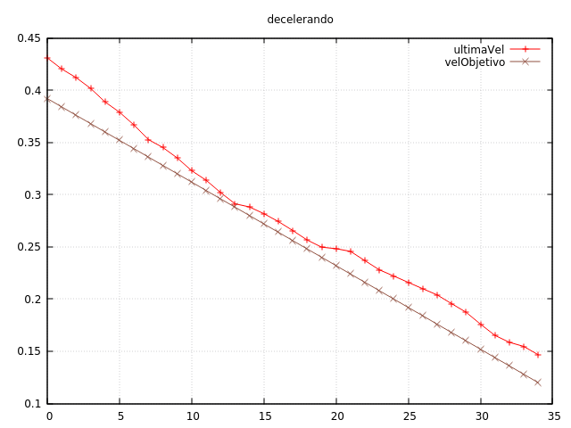

Ahora mismo el robot sólo es capaz de acelerar, frenando bruscamente cuando llega a la posición objetivo.
Necesitamos controlar también la deceleración.

Nos gustaría tener las siguientes posibilidades:

1. En parado, poder ir desde _a_ hasta _b_, en línea recta, y pararse de forma progresiva.
2. En parado, poder girar sobre sí mismo, acelerando y decelerando cada motor de forma progresiva.
3. Partiendo de una velocidad lineal, poder girar con un radio determinado un ángulo determinado.

Además, queremos que una función en la interrupción se encargue de la planificación de velocidades, y en
función del estado actual, decida qué velocidades se le aplican a los distintos motores.

# 1. Recto de _a_ a _b_

En `motores_actualiza_velocidad` siempre incrementamos la velocidad según la aceleración máxima. Sustituimos
esa aceleración máxima por una variable, para poder cambiarla por valores negativos. Dejamos inactiva la
función `set_velocidad()` y en vez de llamar a alguna función en robot, lanzamos los comandos desde `main()`. 

```cpp
// acelero
motores_set_aceleracion_lineal(motores_get_maxima_aceleracion_lineal());
while (motores_get_velocidad_lineal_objetivo_temp() < motores_get_maxima_velocidad_lineal());

// mantengo velocidad constante 1 segundo
motores_set_aceleracion_lineal(0);
timer1_reset_cuenta();
while (timer1_get_cuenta() < 1.0/PERIODO_TIMER);

// decelero
motores_set_aceleracion_lineal(-motores_get_maxima_aceleracion_lineal());
while (motores_get_velocidad_lineal_objetivo_temp() > 0);
Serial.println("3");
motores_set_aceleracion_lineal(0);
```

Funciona perfectamente, y la deceleración (usamos la misma constante que la aceleración, 0.5 m/ss) también
parece que va bien (lo comprobamos imprimiendo el valor de los encoders durante un tiempo después de pararse).
Para recorrer exactamente el espacio que queremos, en vez de hacer la ecuación para el bloque dos, en el que
mantenemos la velocidad, utilizamos los encoders para saber cuándo tenemos que frenar. Si el espacio recorrido
es `e = (1/2) a * t * t`, y el tiempo en decelerar completamente es `v / a`:

```cpp
distancia = 0.4;
parar_en = distancia - 
       motores_get_maxima_velocidad_lineal() * motores_get_maxima_velocidad_lineal() /
       (motores_get_maxima_aceleracion_lineal() * 2);
```

Probamos varias veces y el sistema _casi_ se comporta bien:

```
Recorrrere: 0.40
acelero hasta 0.06
decelero en 0.34 - deberia en 0.34
paro en 0.40151
A> go
GO!
Recorrrere: 0.40
acelero hasta 0.06
decelero en 0.34 - deberia en 0.34
paro en 0.40190
A> go
GO!
Recorrrere: 0.40
acelero hasta 0.09
decelero en 0.34 - deberia en 0.34
paro en 0.40271
A> kp 0.6
kp=0.60
A> go
GO!
Recorrrere: 0.40
acelero hasta 0.08
decelero en 0.34 - deberia en 0.34
paro en 0.40383
A> go
GO!
Recorrrere: 0.40
acelero hasta 0.06
decelero en 0.34 - deberia en 0.34
paro en 0.40422
```



Vemos que se pasa algo menos de medio centímetro. En la gráfica del pid vemos que la velocidad
está siempre por encima del valor deseado. Lo dejamos así porque queremos afinar todo junto, con
los giros sobre sí mismo, y los giros con radio.

commit: 2028b4ce2a1d2a9fa10dff13cf7aacaf7820b9b3
