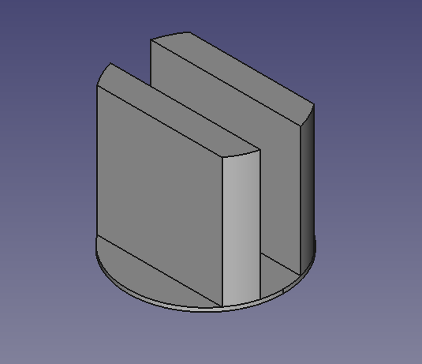
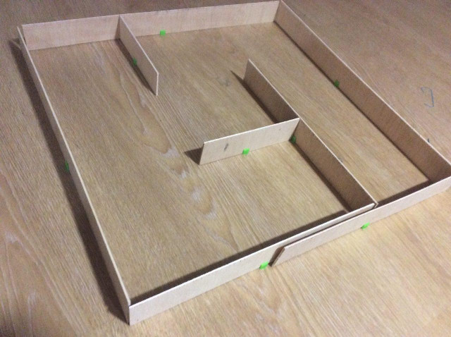

Hoy nos apetecía cortar algo de madera, así que dejamos el ordenador de lado y
con un trozo de madera que había en el garaje, hicimos unas cuantas paredes.

Algún día haremos un laberinto "reglamentario", pero no encontramos la
madera acecuada (de 12 mm) ni tampoco tenemos fresadora para hacer el machihembrado.
Una solución sería hacer paredes con tres chapas de 4mm, dejando la del medio un
poco salientes para que encajen en unas viguetas impresas en 3D. Así parece que
lo hizo la gente de _bulebule_ y les ha quedado bastante bien.

Sólo tenemos chapa de 3mm. Así que no vamos a poder hacer algo muy serio. Pero entre
que buscamos otros materiales, tenemos ganas de ver al robot entre paredes.

# Soporte de contrachapado

Hacemos una pequeña pieza que encaje en el contrachapado y lo mantenga de pie. Así
podemos hacer varios muros de tamaños múltiplos de 18 y configurarlos de varias maneras fácilmente, aunque
no estén fijos y, desde luego, las distancias a las paredes no se parezcan en nada
al laberinto real.

La base es de exactamente 0.3mm, que es la altura de capa que tenemos en nuestra impresora,
para que la tabla quede lo más pegada posible al suelo.

# Laberinto final

Con esta chapuza de laberinto tendremos para una buena temporada. Callejones sin salida, giros de
90 grados, giros en U... Incluso alguna pequeña diagonal posible, para dentro de un par
de años (XD). Parametrizando los tamaños la programación no debería alejarse mucho
de lo que hay que hacer para moverse por el laberinto real.

En este commit no hay programación. Sólo las piezas en freecad para aquél que le pueda
interesar.

commit: 1bf82d02042364e8453995611b73d86a43f8fef2
