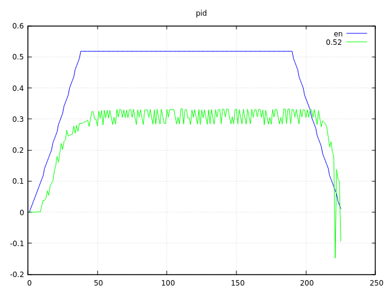
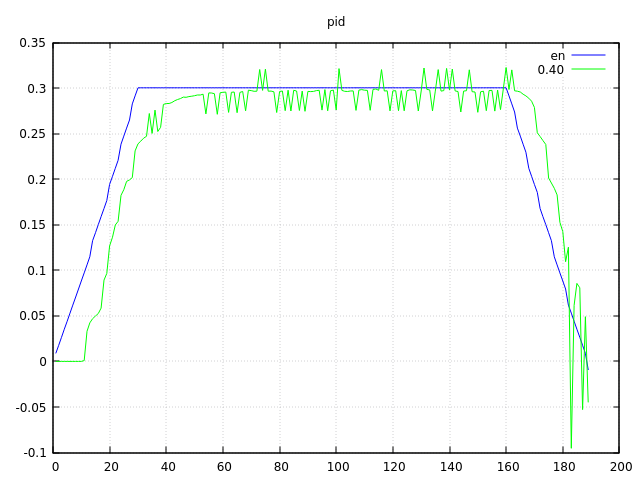

Ayer dejamos el commit bastante mal y hoy hemos aclarado un poco las
ecuaciones de los cálculos de la velocidad. Ya conseguimos hacer
un círculo de radio 9cm, y nos ha costado porque encontramos un nuevo
problema.

Nos dimos cuenta que la rueda exterior no consigue superar los 0.3 m/s,
casi la mitad de lo que conseguimos en línea recta. Suponemos que tiene
que haber na razón física, algo como que la fuerza centrífuga (el coche
pesa bastante) ejerce cierta presión en la ruedas... no sabemos. El caso
es que no había error en los cálculos, ya que el pwm se mantenía al máximo
y aun así no superaba esa velocidad.

Así que nos tendremos que conformar con unos 0.2 m/s en este tipo de curvas,
para que la velocidad de la rueda exterior sea un poco menor a los 0.3 y
el pid tenga margen de maniobra.

Casi lo tenemos. El robot gira bien pero se pasa de largo, unos 20 grados,
que es mucho.

# Bug en `motores_set_pwm`

De nuevo empezamos a complicarnos con los cálculos. El robot empezaba a abrir
el radio. Nos dimos cuenta que en `motores_set_pwm` manteníamos la constante
de preprocesador MAX_PWM, y cuando la batería está baja, necesitamos más de
ese valor para mantener el radio.

# Control final de pasos de encoder

El robot se nos seguía pasando un pelín. Así que salimos del bucle cuando
los pasos del encoder exterior se corresponden con los que deberían ser (en
un mundo ideal). Ahora, curiosamente, se nos queda un pelín corto. De todos
modos, damos los cálculos por correctos, esperando un ajuste final del pid,
con todos los movimientos, y definir exactamente de que manera vamos a controlar
el robot en la interrupción, con todos estos puntos intermedios de cambios
de aceleraciones.

commit: 9fff789c758e94ff1b1baf18718fd850ab6273aa
