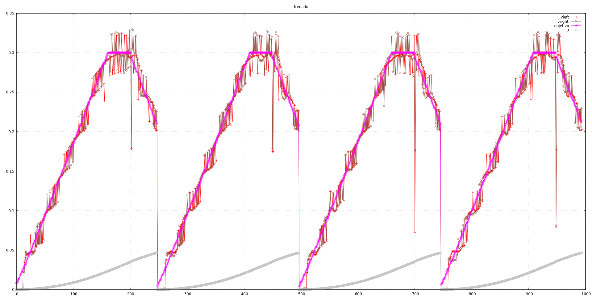

Antes de empezar unas pequeñas cosas:

Nos faltaba ayer una acción para el giro en redondo. Sin esforzarse mucho,
utilizamos un parches no muy elegante para tratar este caso especial.
Este giro, realmente tiene una velocidad lineal y aceleración lineal igual a 0, pero
ya nos habíamos deshecho de la aceleración angular. Así que usamos un subterfugio
en `motores_actualiza_velocidad()` para que, en el caso de radio 0, utilize los
valores de velocidad lineal aplicando a cada motor los resultados con distinto signo.

Aprovechamos y añadimos otro _parche_ para poder meter acciones de "espera". Si la
velocidad de la acción es 0, el controlador en `robot.cpp` espera el número de 
segundos especificados en el radio de la acción.

# Corrección angular

Una cosa más: introducimos una pequeña corrección angular para, por lo menos en línea
recta, intentar que ambos encoders se acerquen al valor. Una constante `Kp_angular` que podemos
setear con la línea de comandos será la proporcional de dicha corrección.

```
error_angulo = encoders_get_posicion_total_left() - encoders_get_posicion_total_right();

velocidad_lineal_objetivo_left += error_angulo * kp_angular;
velocidad_lineal_objetivo_right -= error_angulo * kp_angular;
```

Por ahora lo vamos a poner a 0 porque vemos que influye en la máxima velocidad alcanzada.

# Logueando gráficos

Hemos puesto unos `Serial.print` en el `main()` para hacer gráficas. Escribimos el número
de acción al principio para poder filtrar los resultados del gnuplot.

```
~cat /tmp/data.dat | egrep "1 [0-9]{1,} [0-9\.]{4,} [0-9\.]{4,} [0-9\.]{4,} [0-9]{1, }" > /tmp/data2.dat && gnuplot docs/plots/2019-02-05.gp
```

# Distancia de frenado

No conseguimos averiguar porqué tarda tanto en frenar. A pesar de ajustar el pid (kp=2) de nuevo,
ya que estábamos siempre por debajo del objetivo en el arranque y siempre por encima en la 
frenada, está muy lejos del punto óptimo de alcanzar la velocidad final solicitada en la acción.



En la gráfica se ven distintos intentos de un segmento de 18cm, con aceleración y frenado en
0.5 m/s. Se ve que se llega a la distancia objetivo mucho antes de que la velocidad sea 0 
(que hemos puesto en la acción como velocidad final). Quizá algún día nos riamos de esto pero
es que no damos con el problema. Mañana, más acciones.

commit: 633194c70b7cda7a9ad1fa13f5efdabd5c5e3507
