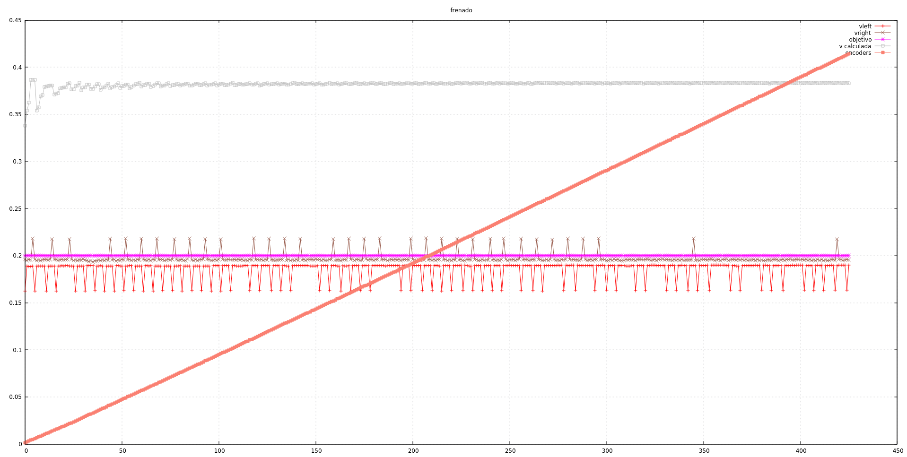
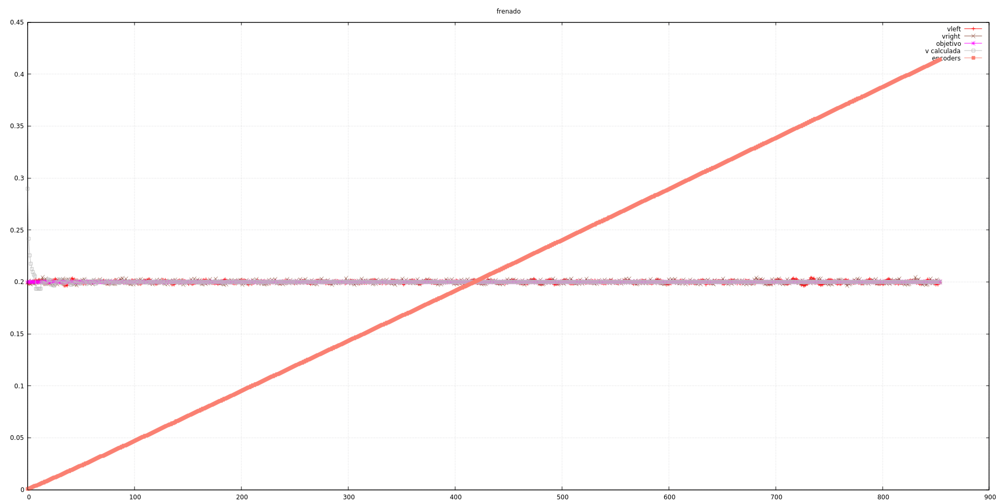
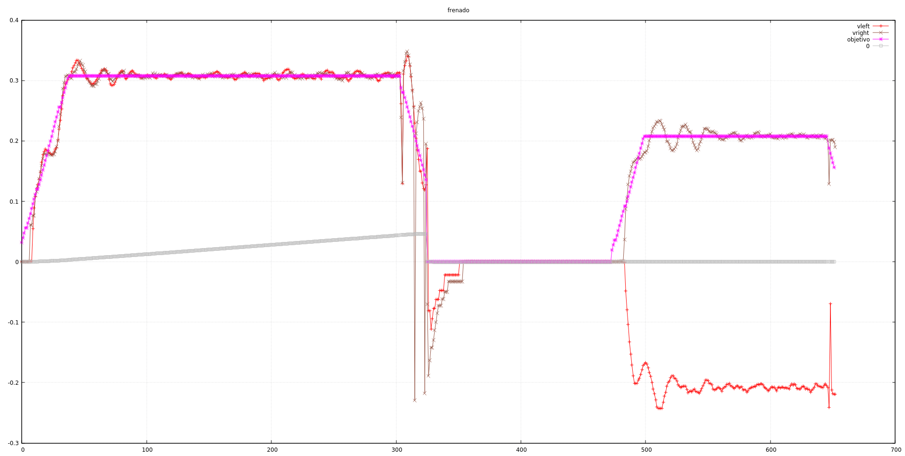

Estábamos bastante confusos con los resultados de ayer. Nos parecía poco probable
que hubiese una conspiración mundial que nos ocultara las verdaderas ecuaciones
de la termodinámica, así que supusimos que teníamos algún fallo en el cálculo
de velocidad.

Había dos cosas que nos estrañaban: lo mucho que tardaba en alcanzarse la velocidad
máxima, y ese rizo periódico de las velocidades devueltas por las funciones en
encoder. Probamos varias cosas, que dejamos en este commit (las quitaremos en el
siguiente).

- Intentamos ver si la interrupción del timer estaba "saturada" en tiempo y quedaba
poco margen para setear los valores de `ultimo_tcnt1` en las ISR del encoder. De ahí
el "bucle inútil" comentado del `main()` y el nuevo getter de `ultimo_tcnt1_right`,
para poder inflar el timer en tiempo y ver los resultados. Encontramos que aún teníamos
margen para programar más cosas.

- Limpiamos la rutina de tiempo, dejando únicamente lo necesario para calcular la velocidad
y la imprimimos en el bucle `main()`. Nos seguía dando el mismo problema.

- Imprimimos en el bucle princpal las velocidades, pero además la velocidad calculada a partir
de los saltos totales del encoder con respecto al tiempo transcurrido. Ahí dimos con un
problema gordo:



En este gráfico, la línea gris superior corresponde a la velocidad calculada, mientras que
la línea rosa es la velocidad objetivo (y alrededor de ella aparecen las velocidades de cada
encoder. El robot se mueve realmente prácticamente al doble de la velocidad objetivo que se
le manda. La diagonal es simplemente el número de pasos de encoder, sólo para ver la linearidad
en el tiempo de los datos.

- Despues de repasar un montón de cálculos, damos finalmente con el problema:

```cpp
// codigo en motores_set_potencia(potencia_left, potencia_right)
    encoders_set_direccion(potencia_left > 0, potencia_right > 0);

// constantes en encoders.cpp
#define DIRECCION_ADELANTE 0
#define DIRECCION_ATRAS 1
```

Se ve claro, no? Las variables que indican la dirección del encoder se ponen a _true_ si
la potencia correspondiente es mayor que 0. Pero las constantes están al revés. Y provoca
que se entre en un `if` en la función de cálculo que no debiera.

Resumiendo, sólo sustituyendo el 0 por el 1 y viceversa, el gráfico queda así:



y las cuatro líneas de velocidad real calculada, velocidad objetivo y de los encoders, se funden
perfectamente. De todos modos, tenemos que revisar la utilización de las direcciones.

# Probando lo de ayer

Hay que hacer un par de ajustes en las acciones, tal y como las estamos probando:

- Cuando una acción termina en velocidad 0, tenemos que poner como velocidad final algo pequeño,
pero no 0. Si ponemos 0, lo que ocurre es que el robot va decelerando llega a 0 cuando quedan
unos pequeños pasos de encoder, lo que impide que la acción termine y la deceleración sigue
decrementando la velocidad de forma infinita. Un valor de 0,09 m/s es suficiente para que al
terminar la acción y "clavar" los motores, no se note un cambio brusco. Quizá en el futuro
miremos otra solución.

- Hemos cambiado el giro sobre sí mismo para que se guarde el doble de distancia de la que se
pide. De esta manera contamos el giro de ambas ruedas y, si por algún motivo, alguna va
a más velocidad que la otra, el ángulo queda aproximadamente corregido.

Ahora tenemos esto:



La segunda parte del gráfico muestra el giro a 90 grados, por eso las velocidades están enfrentadas.
Ahora ya tenemos algo mejor con lo que trabajar. En este punto querríamos haber acabado ayer, pero
mereció la pena encontrar el error anterior y seguir desde aquí.

commit:
