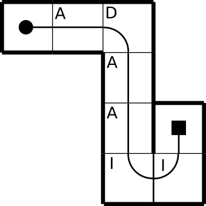

Teníamos los conceptos un poco difusos y los vamos a concretar:

- **acción**: se corresponde con un segmento de movimiento, delimitado
a una distancia (que no tiene que ser múltiplo ni divisor de una casilla) y que tendrá una _velocidad máxima_, una _velocidad final_, y un _radio_, además de dos aceleraciones distintas, inicial y final.
Es lo que tenemos implementado ahora mismo en `robot.cpp`.

- **secuencia**: es una lista de movimientos por *casillas*. En estos momentos iniciales, un movimiento de una secuencia se corresponderá con una
única acción, aunque sus parámetros pueden ser distintos.

Definamos una pequeña secuencia de movimientos, que englobe varias posibilidades que nos podemos encontrar en la navegación
del laberinto:



Tenemos alguna recta larga, un giro normal y un giro doble. Esta trayectoria se correspondería con la secuencia _ADAAII_. Por ahora no
nos complicamos y cada _letra_ de la secuencia se corresponderá con una única _acción_. Hay además unas acciones invisibles, no especificadas en la secuencia,
que se corresponden con el avance en la primera casilla y la frenada final. 

Haciendo la tabla, vemos que hay constantes que se repiten:

- _vr_: velocidad máxima en recta
- _vc_: velocidad máxima en curva
- _dist_: la longitud de una casilla
- _distg_: la longitud de un giro simple, es decir pi/2 * radio (siendo en este caso el radio la longitud de la casilla / 2)
- _amax_: aceleracion máxima
- _acur_: aceleracion anterior a la entrada en curva
- _afin_: aceleración final

| **accion**  | **distancia** | **aci**  | **acf** | **v máx**| **v final** | **radio** |
|-----------|:------:|:----:|:--:|:---:|:--:|:---:|
| 0-inicial | dist/2 | amax | amax | vr  | vr | inf     |
| 1-A       | dist   | amax | acur | vr  | vc | inf     |
| 2-D       | distg  | amax | amax | vc  | vc | dist/2  |
| 3-A       | dist   | amax | amax | vr  | vr | inf     |
| 4-A       | dist   | amax | acur | vr  | vc | inf     |
| 5-I       | dist   | amax | amax | vc  | vc | -dist/2 |
| 6-I       | dist   | amax | amax | vc  | vc | -dist/2 |
| 7-final   | dist/2 | amax | afin | vc  | vc | inf     |

Las abrebiaturas _aci_ y _acf_ se corresponden con aceleración inicial y aceleración final.

En la columna de aceleracion inicial siempre vemos _amax_. Quizá en el futuro eliminemos esta columna. En recta, está claro que este
valor lo tenemos que calcular de forma empírica, pero en curva no tiene importancia, ya que _deberíamos_ llegar a ella a una velocidad
correcta y nunca tendríamos que acelerar.

Resumiendo, las curvas son todas iguales (intentaremos darlas a una velocidad constante vc) y en las rectas intentaremos acelerar todo
lo posible, especificando una velocidad final en la recta en función del siguiente segmento. El código sería algo así:

```cpp
    _crea_accion(DIST/2, AMAX, AMAX, VR, VR, INFINITO);   // inicial
    _crea_accion(DIST  , AMAX, ACUR, VR, VC, INFINITO);   // avanza
    _crea_accion(DISTG , AMAX, AMAX, VC, VC, DIST/2);     // derecha
    _crea_accion(DIST  , AMAX, AMAX, VR, VR, INFINITO);   // avanza
    _crea_accion(DIST  , AMAX, ACUR, VR, VC, INFINITO);   // avanza
    _crea_accion(DISTG , AMAX, AMAX, VC, VC, -DIST/2);    // izquierda
    _crea_accion(DISTG , AMAX, AMAX, VC, VC, -DIST/2);    // izquierda
    _crea_accion(DIST/2, AMAX, AFIN, VC, VC, INFINITO);   // final
```

El robot se mueve "parecido" a nuestro dibujo, aunque los ángulos no están correctos y alguna vez (hoy no miramos gráficas) se pierde
en los giros a la izquierda. Pero esta parece una buena base para empezar a depurar todos los parámetros (velocidades y constantes
de pid) todas juntas, sin miedo a que depurando un movimiento estemos estropeando otros.

commit: cc6eae78c5a7502d3802fc370f727691bf3e9283
