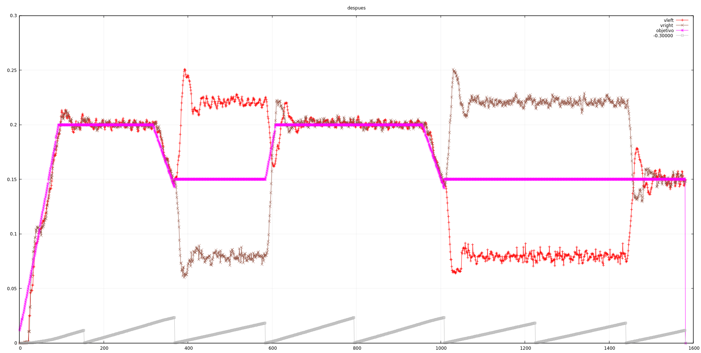

Primero, creamos un nuevo entorno de compilación para evitar los `Serial.print` en los cambios
de acción. Así eliminamos unos picos extraños en las gráficas, debidos a cálculos erróneos porque
la interrupción no se conseguía ejecutar en su período asignado.

Empezamos así:


Hemos dejado los datos `antes.dat` y el script
de gnuplot en el commit del código fuente, en la carpeta de 'docs/plots'. Las acciones se distinguen
en el gráfico porque en cada una se resetea la cuenta total de los encoders (línea gris). Hay
un par de problemas que saltan a la vista:

- Mucha oscilación alrededor de la velocidad objetivo (rosa) en toda la traza
- La velocidad objetivo aumenta en cada acción.

# Velocidades objetivo

De nuevo nos encontramos con el problema de que no empezamos a acelerar cuando debemos. Después de
añadir unos serial print en el `main()` que nos mostraran la velocidad objetivo y la aceleración vemos
que las velocidades no se estaban restando bien... En algún momento del desarrollo eliminamos la función
`motores_actualiza_velocidad()` del timer, para limpiarlo un poco, y lo pusimos en `robot.cpp`. Luego,
en alguna prueba simple, lo necesitábamos en el `main()` y ahí quedó. Se estaba llamando dos veces.

# Error en cálculo de distancia de frenado

La ecuación del calculo de la distancia de frenado la hicimos para las primeras pruebas de segmentos
simples, acelerando, yendo a una velocidad máxima y frenando hasta 0. Pero si ya tenemos velocidad, 
el espacio no es 1/2 a * t * t, sino que hay que sumarle la componente de la velocidad mínima.


```
float _distancia_para_decelerar(float vi, float vf, float aceleracion) {
    return (0.5 * (vi - vf) * (vi - vf)) + (vi * (vi - vf) / a);
}
```

Después de un susto inicial, en el que parecía que tampoco conseguíamos frenar a tiempo, nos dimos
cuenta que teníamos una aceleración muy pequeña. Se empezaba a decelerar según empezaba el tramo
pero simplemente no había tiempo suficiente.

Nos quedamos por ahora así:



Muchísimo mejor. No acaba de coincidir la frenada con la velocidad siguiente pero el error es
muy pequeño.

# Refactorización en comando.cpp

Creamos setters para las variables implicadas en el control de las velocidades, y poder afinar
por bluetooth sin tener que subir sketches, que notamos que nos gasta la batería bastante pronto.
Como ya teníamos bastante código repetido en `comando.cpp` y no tenemos más que setters, 
aprovechamos para refactorizar todos
los `ifs` y utilizar una función auxilar para que quede más limpio.

```cpp
void _procesa_setter(char const *comando, char *token, char *parametro,
        void (*setter)(float), float (*getter)()) {
```

y asi definimos un setter con:

```cpp
char const *comando_kp = "kp";
_procesa_setter(comando_kp, token, parametro, motores_set_kp_lineal, motores_get_kp_lineal);
```

Aún no empezamos a definir las velocidades y aceleraciones máximas! Pero lo vamos a dejar
para mañana.
