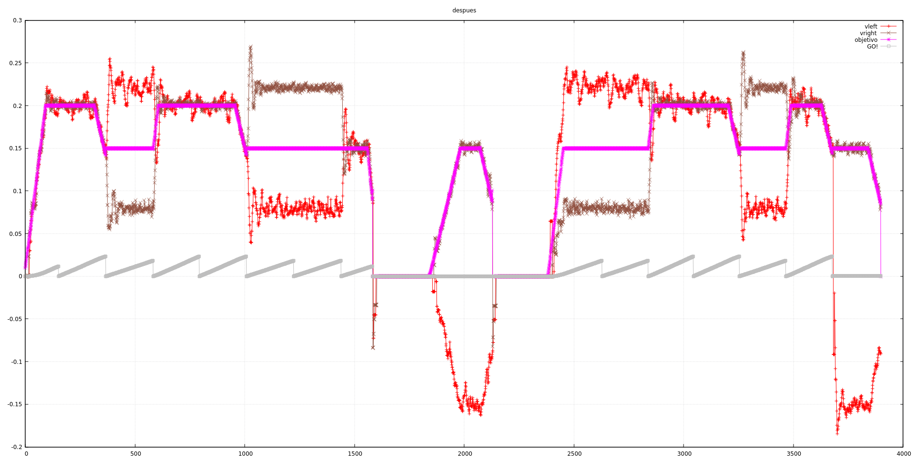

Hoy no tenemos mucho tiempo así que vamos a hacer dos cosas simples:

# Frenada

Ayer se nos quedó sin poner la velocidad final a 0 en la frenada final y ni nos dimos
cuenta al ver el gráfico. Paraba bruscamente pero lógicamente hay que frenar con
un poco de control. El problema es que, si ponemos la velocidad final a 0 y deceleramos
(como es debido), el robot puede llegar a 0 antes de los pasos objetivo (por poco, pero
antes), y sigue aplicando aceleración (que es negativa) y acaba yendo hacia atrás 
hasta el infinito. Ya nos había pasado antes, así que lo corregimos simplemente poniendo una 
velocidad final pequeña pero suficiente para poder frenar "de golpe" en el sigiente tick
de reloj

# Giro sobre si mismo y vuelta a empezar

Para comprobar la repetibilidad, haremos que gire sobre si mismo al final del camino
y lo vuelva a hacer en sentido contrario. Así que metemos el giro de 180 grados y el
camino de vuelta. Nos ocurre lo mismo que en el caso anterior. Por eso ponemos la velocidad
final a 0.1

Aquí tenemos que dejarlo

commit: a4822ae3c1d2363eecc1ae344615e500a01c1a23
