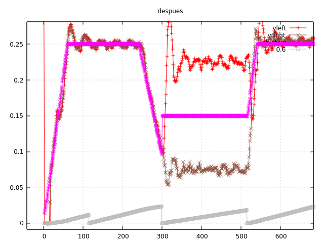

Comenzamos definiendo un setter para la distancia entre las ruedas. Según nuestras
cuentas, la ecuación que calcula el ángulo de giro en función de los espacios recorridos
por ambas ruedas es correcta e independiente del cambio de posición sobre el centro del
coche. Es decir: si una rueda gira algo más que la otra, en un giro en redondo nos
estaremos desplazando un poco en la posición, pero el ángulo debería estar bien. Sin
embargo, nos quedamos cortos. Quizá las ecuaciones estén mal, pero como la única
variable que influye es la distancia entre las ruedas, vamos a experimentar con ella y
ver si se sigue comportando bien en los giros normales.

El valor que se comporta para la distancia entre ruedas es 0.9.

# Pruebas con distintos valores de velocidad

Vamos a ir aumentando los valores de velocidad y aceleración hasta que veamos que aún
hay cierto control y nos quede margen.

El robot puede acelerar a 1 m/ss e incluso más (eso parece). También alcanzamos con 
facilidad y manteniendo el control unos 0.4 m/s. En curva, un valor de 0.30 parece
ir bien.

# Error en cálculo de distancia de frenado

Ayer vimos que después de una frenada, la velocidad variaba un poco con la que deberíamos obtener,
pero pensábamos que era debido a pequeños errores en el control. 

Al ir aumentando las velocidades, este error era más latente y nos dimos cuenta que teníamos
un error en la transcripción de la fórmula (en el post de ayer se ve que no coinciden las
notas en papel con el código).

# ... y ya no miramos más.

Por qué? El diseño del robot que tenemos ahora mismo es muy ancho. Nos gustaría
al menos intentar que el robot hiciera diagonales, y con nuestro tamaño (unos 10.5 cm) es
físicamente imposible. Tenemos que reducirlo sobre unos 9 mm. Esto se puede hacer con
nuestros motores, ya que tenemos un buen hueco en el medio.

Con robot más estrecho y menos distancia entre las ruedas, las curvas deberían ser más fáciles,
ya que la diferencia de velocidad entre las ruedas será menor que la que tenemos ahora. El
caso es que para deshacer la oscilación del pid que tenemos ahora cuando entramos en una
curva tendremos que aplicar unos parámetros que no van a valer para el diseño final. Así
que no vamos a intentarlo más.

Volveremos a esto cuando tengamos el nuevo diseño, pero antes, (y ya tenemos bastantes ganas)
empezaremos a mirar cómo funcionan los sensores infrarrojos y de qué manera los vamos a colocar.

commit: d0ad87e6089080e5ca51ed46e7f1c228f5838233

