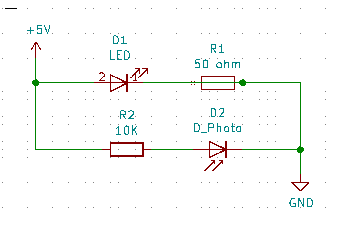
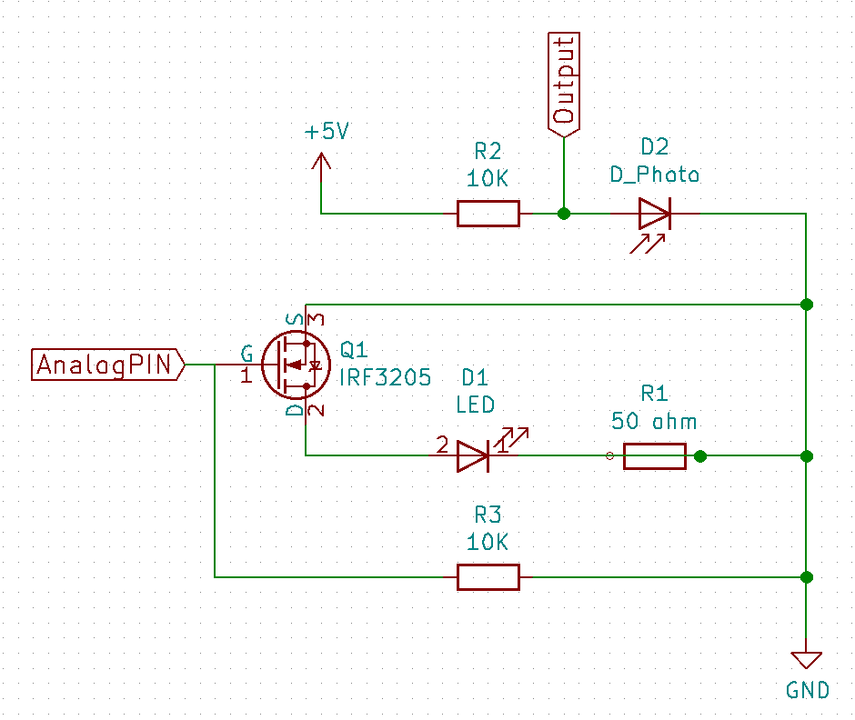

Los mejores micromouse que hemos visto llevaban diodos infrarrojos de alta
potencia y un fototransistor como receptor, para detectar las paredes y medir
la distancia a ellas, así que no vamos a ser menos.

Utilizamos unos [TEFT4300](https://www.vishay.com/docs/81549/teft4300.pdf) como detector
y los diodos [SFH 4545](https://dammedia.osram.info/media/resource/hires/osram-dam-2496274/SFH%204545.pdf).

# Circuito básico

La datasheet nos resulta algo confusa. Hay bastantes parámetros que no entendemos pero nos
quedamos con lo siguiente:

- Máxima corriente: 100 mA
- Potencia: 180 mW

Con 100 mA podríamos poner una resistencia limitadora de 50 ohm. De forma contínua esto daría una
potencia de 500 mW. Así que el ciclo de trabajo tendrá que ser como mucho del 27.7%. Nuestra intención
es soltar ráfagas pequeñas (encender-medir-apagar), y no deberíamos tener problemas de tiempo.

Con el datasheet del fototransistor nos pasa un poco lo mismo... así que vamos a usar una resistencia de carga de
10K, que debería ser segura. El circuito queda así:

Esto teniendo en cuenta que no podemos alimentar el circuito con 5 V constantes.

# Transistores de activación

El arduino no puede proporcionar 100 mA por sus salidas digitales, así que necesitamos activar los
diodos por medio de un transistor. Tenemos por ahí unos [IRF 3205](http://pdf1.alldatasheet.com/datasheet-pdf/view/68131/IRF/IRF3205.html),
que son enormes, pero vamos a probar con ellos. Con un Gate Threshold Voltage entre 2 y 4v, deberíamos
poder activarlos sin problema. Quedaría así:

Nos faltan las resistencias de 50 Ohm... podríamos usar 4 de 220 en paralelo pero se nos amontonan
los componentes en la protoboard. A ver si se consiguen fácil en una tienda local, y si no, esperamos
a que nos llegue mientras miramos otra cosa.
