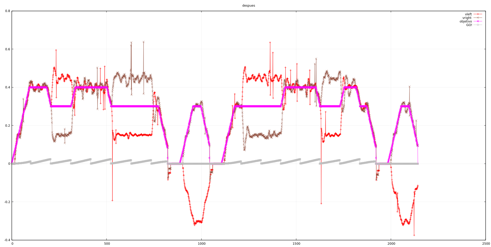

Vamos entonces a dividir el proceso en cuatro partes, dándole a cada una
1 milisegundo. El periodo total seguirá siendo de 4ms, pero tendremos que cambiar
el cálculo en `encoders.cpp`.

# Nuevas variables en settings.h

Introducimos una constante de preprocesador y algún cálculo directo para no hacerlo
en la `encoders.cpp`

```cpp
#define PERIODO_TIMER 0.001
#define NUMERO_ESTADOS 4
#define PERIODO_CICLO (PERIODO_TIMER * NUMERO_ESTADOS)
#define OCR1A_POR_CICLO (OCR1A * NUMERO_ESTADOS)
```

# Cambios en encoders.cpp

Ahora el `tcnt1` que consideramos dependerá del estado, así que creamos un getter
de estado en `timer1.cpp` (este estado se incrementa en `timer1_incrementa_cuenta()`,
y lo tenemos en cuenta para el cálculo del tcnt1.

```cpp
ultimo_tcnt1_right = OCR1A * timer1_get_estado() + TCNT1;
```

Deja de tener sentido el nombre de la variable, pero lo vamos a dejar por ahora.

El cálculo de la velocidad es parecido, pero ahora tenemos en cuenta que cada
ciclo incluye 4 estados.

```cpp
velocidad_left = LONGITUD_PASO_ENCODER * encoder_posicion_left * OCR1A_POR_CICLO /
    (PERIODO_CICLO * ( (int32_t) OCR1A_POR_CICLO * (ticks_sin_actualizar_left + 1) + ultimo_tcnt1_left - tcnt1_anterior_left));
```

Y sólo falta cambiar en varios ficheros el PERIODO_TIMER por PERIODO_CICLO

# Prueba

La prueba se parece bastante [a la última](https://recunchomaker.github.io/adefesio/terminamos-con-los-motores/) que
hemos puesto aquí, aunque como quitamos el control de MIN_TCNT1 vuelven a aparecer esporádicamente picos de velocidad (por
arriba y por abajo) claramente erróneos. Creemos que tiene que ver con esto pero no nos queremos dispersar y seguiremos
con los diodos, porque en el movimiento real del robot no se nota diferencia.


