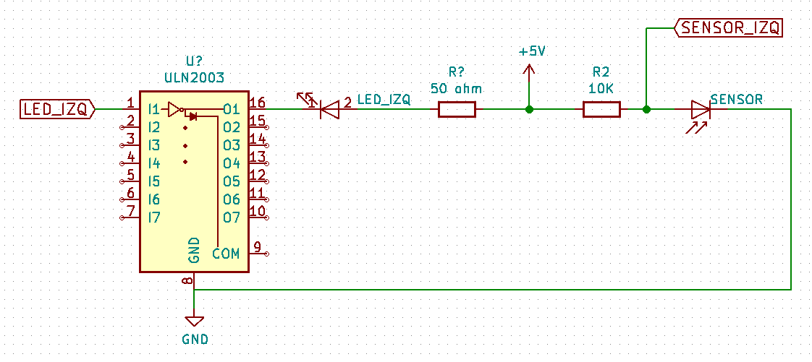

Hoy vamos a ver si conseguimos detectar cosas delante de los diodos, ya conectados
a los transistores. Encontramos de casualidad un 
[ULN203](http://pdf1.alldatasheet.com/datasheet-pdf/view/25575/STMICROELECTRONICS/ULN2003.html)
que son un conjunto de
7 transistores empaquetados en un único chip, muy fácil de soldar, y que nos ahorrará
un montón de cableado y espacio. El esquema queda muy parecido.

# Prueba con un sensor y resistencia de 220 ohm ohm ohm

Conectamos el sensor con el diodo infrarrojo, pero manteniendo la resistencia de 220 ohm. El
sensor parece responder bien, dando una lectura de unos 990 (sobre 1024) sin ningún obstáculo
delante y empezando a responder lentamente a unos 20cm, con muy poco márgen.

# Resistencia de 50 ohm

La lectura sin obstáculos baja a 870. Y es mucho más sensible, como alrededor de 50 cm ya empieza
a detectar. Siguiendo los consejos de los creadores de bulebule, recubrimos ambos componentes
con un trocito de tubo termoretráctil negro, y la lectura sin obstáculos sube a 1000. O sea que
sí que aisla del ruido exterior. 

Damos el esquema por bueno y lo siguiente será conectar los cuatro diodos y transistores, y
poner todo en una pequeña baquelita.

> **Ojo:**
> Estas pruebas las estamos haciendo con el mismo sketch pero con un arduino uno, que no tiene entrada A6.
> Así que estos commits, hasta que no hagamos la placa de sensores y la incorporemos al robot, tienen cambiado el pin de batería y la función que controla si está agotada o no, devuelve siempre _false_.

commit: b0bdcefb5d2fa43c91b450caed0d80645b0abd68
