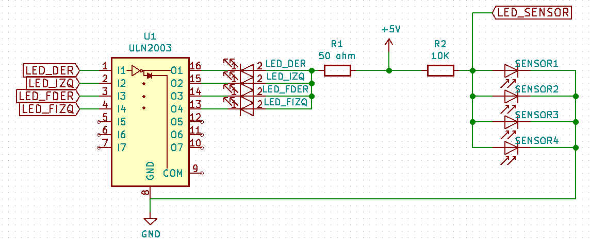
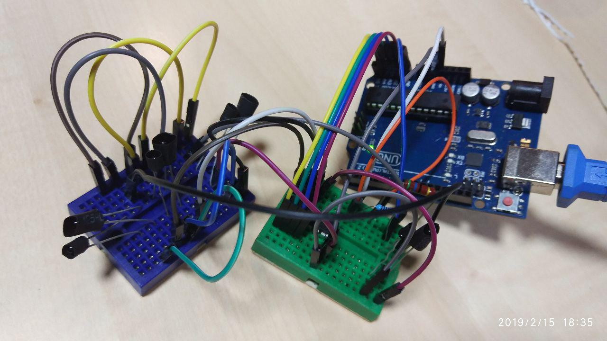

En el futuro, nos gustaría poder ponerle a nuestro robotito un par
de botones, un buzzer, algún led... pero es que nos estamos quedando sin
pines.

Por ahora estamos así:

| **arduino nano**       | **conexión** |
|:--------------|:-|
| D0            | RX |
| D1            | TX |
| D2            | ENCODER_LEFT_C1 |
| D3            | ENCODER_RIGHT_C1 |
| D4            | MOTOR_LEFT_IN2 |
| D5            | MOTOR_LEFT_PWM |
| D6            | MOTOR_RIGHT_PWM |
| D7            | MOTOR_RIGHT_IN1 |
| D8            | ENCODER_RIGHT_C2 |
| D9            | MOTOR_LEFT_IN1 |
| D10           | MOTOR_RIGHT_IN2 |
| D11           | - |
| D12           | ENCODER_LEFT_C2 |
| D13           | BATERIA_LED_PIN
| A0            | BATERIA_LED_PIN |
| A1            | LED_IZQ |
| A2            | LED_DER |
| A3            | LED_FIZQ |
| A4            | LED_FDER |
| A5            | - |
| A6            | - |
| A7            | - |


Nos quedan 4 pines libres. Podemos "rascar" un par de pines de los encoders, que no estamos
utilizando (aunque nos gustaría dejarlo así incicialmente por si, en pruebas más largas, detectamos
el típico problema de los disparos fantasma cuando el motor se queda parado justo en el punto
de transición del encoder). 

Nuestro puente H tampoco ayuda, al necesitar 3 pines por motor (podríamos cambiarlo, quizá más
adelante, por otros que sólo necesitan dos pines por motor).

# Circuito simplificado 
Resumiendo: vamos a comprobar cómo se comportaría un sistema en el que compartimos el pin de entrada y,
ya puestos, la resistencia limitadora de corriente para el led. Una cosa así:



Aunque los sensores se encenderán en secuencia (sólo 1 estará encendido en un momento dado), pudiera ser
que a los rebotes afectaran a otros sensores... sólo hay una manera de averiguarlo.




# Probando

Creamos una secuencia de prueba en `main()`, de manera que cada ciclo (cada milisegundo) se enciende un
led, y en el siguiente se lee y se apaga inmediatamente después.

```cpp
    switch (timer1_get_estado()) {
        case 0: 
                leds_actualiza_valor(LED_FDER);
                leds_enciende(LED_IZQ);
                break;
        case 1: 
                leds_actualiza_valor(LED_IZQ);
                leds_enciende(LED_DER);
                break;
        case 2: 
                leds_actualiza_valor(LED_DER);
                leds_enciende(LED_FIZQ);
                break;
        case 3: 
                leds_actualiza_valor(LED_FIZQ);
                leds_enciende(LED_FDER);
                encoders_calcula_velocidad();
                encoders_reset_posicion();
                motores_actualiza_velocidad();
                robot_control();
                break;
    }
```

La función `actualiza_valor` lee el sensor, luego apaga el led y vuelve a leer. Así eliminamos
el ruido "ambiente" de infrarrojos, aunque NO el ruido que el led encendido provoca en otros sensores.

```cpp
void leds_actualiza_valor(int8_t led) {

    leds_lectura0 = analogRead(LED_SENSOR);
    leds_apaga(led);
    // sin esperas maxima lectura 230
    delayMicroseconds(15); // maxima lectura 460
    delayMicroseconds(15); // maxima lectura 650
    delayMicroseconds(15); // maxima lectura 710
    //delayMicroseconds(15); // maxima lectura 710
    leds_lectura1 = analogRead(LED_SENSOR);

    leds_valor[led - A1] = leds_lectura1 - leds_lectura0;
}
```

Hemos tenido que poner bastante espera para poder leer el sensor una vez apagado el led. A partir
de 45 microsegundos se estabiliza... Es un tiempo considerable pero no podemos saber lo que afectará
a las ISR hasta que lo probemos con el motor en movimiento. De todos modos, lo que queríamos comprobar
es si el circuito se comporta bien, y parece que si. Hay un pequeño ruido en el sensor. Cuando medimos
lo que correspondería a un LED, las otras medidas se ven afectadas por un pequeño margen (4 o 5 unidades)
Pero no parece muy grave.

Lo siguiente será poner todo este tinglado en una baquelita, decentemente soldado, y probar in situ.
