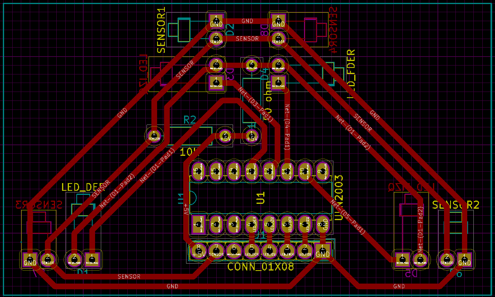

Antes de empezar a soldar sin control, aprovechando que tenemos el esquema
hecho en KiCad, vamos a intentar colocar de una manera adecuada los componentes
para que el enrutado sea sencillo de hacer manualmente con soldador y cables. También
nos gustaría (en un futuro algo lejano) conseguir hacer una única PCB con
todos los componentes, así que este sería un primer paso.

Añadimos un conector de pines macho que se conectará a nuestro circuito principal,
con un bus de 8 pines: voltaje, tierra, sensor analógico, 4 para encender individualmente
los diodos y dejamos uno más por si finalmente añadimos un buzzer.

Desplazamos la entrada de los diodos en el ULN2003 sólo para que nos quede un poco más ordenado. Organizando
un poco los diodos y sensores para que sean simétricos (en la PCB algunos aparecen por el otro lado) conseguimos
enrutar todos los componentes en una sola capa.

Dejamos el proyecto KiCad en la carpeta _docs_ del master. Tenemos MUY poca experiencia
con KiCad (realmente nula), así que seguro que hay errores o cosas que se deberían hacer
de otra manera. El circuito tampoco es correcto eléctricamente: no hay ni un sólo condensador para
estabilizar la corriente y probablemente el ruido de los motores interferirá en la lectura.
Todo esto es más bien una prueba de concepto. Pero a partir de aquí, sólo se puede mejorar.

commit: 57397b83716dbf87c15f214aa6e451dfdb70c4f9
