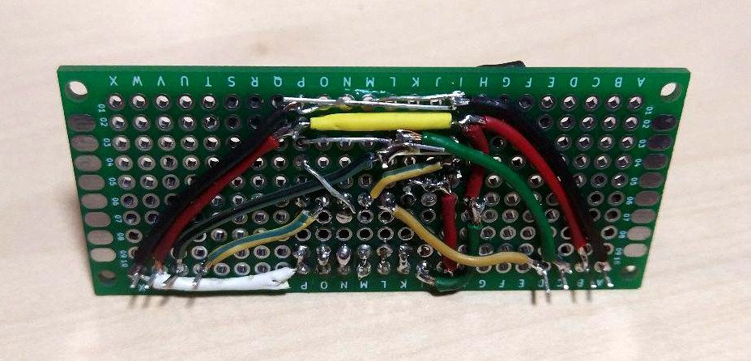
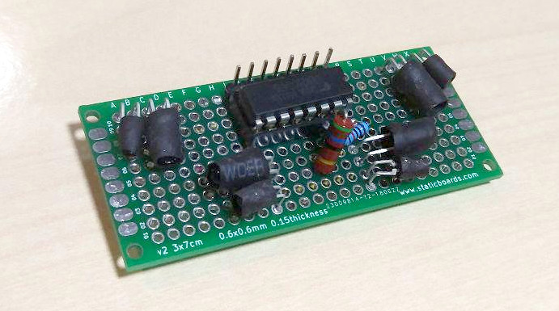

Somos algo torpes soldando y nos ha llevado un montón de tiempo hacer
el circuito, pero por fin lo hemos terminado. Y sorprendentemente funciona.

No teníamos un zócalo para el módulo ULN2003, así que utilizamos uno más pequeño
y quedan dos patillas fuera... Por lo demás, todo ha funcionado. Es especialmente
trabajoso fijar los sensores y diodos intentando que estén a la misma altura. De
todos modos, tienen bastante patilla sobrante y se pueden girar y ajustar manualmente.
Presentimos que esto va a dar también un poco de trabajo cuando se calibre todo, ya que
una pequeña variación del ángulo sensor/diodo afecta mucho a la lectura.

