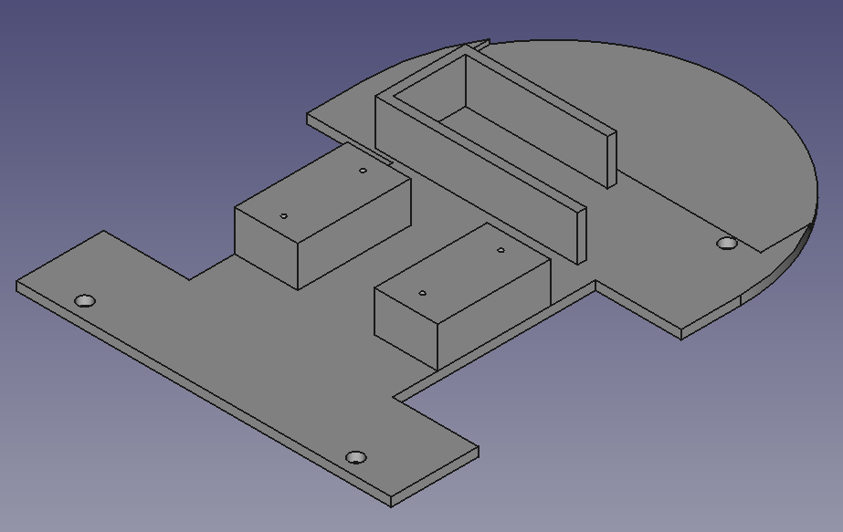
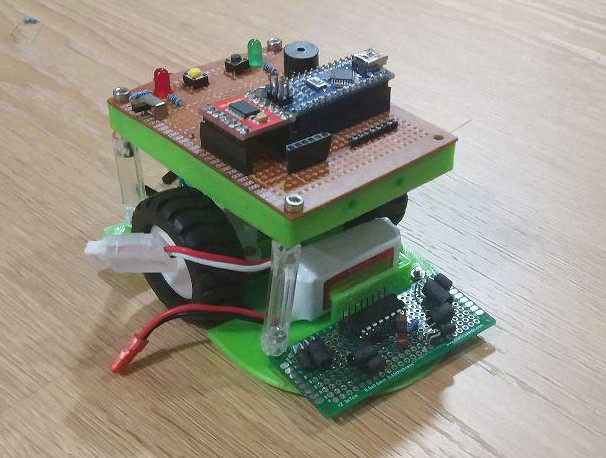

Para poner los sensores, vamos a diseñar un pequeño chasis "inferior". Lo que
necesitaríamos es lo siguiente:

- Juntar los motores lo máximo posible para minimizar el ancho del robot
- Poner el soporte para atornillar los motores, un espacio para la batería,
y un sitio en el que atornillar la placa de sensores
- Dejar taladros para atornillar por encima la placa que tenemos hasta ahora,
con el arduino, puente H, interruptor...

Nos sale una cosa así:

Juntando los motores, nos sale un ancho de unos 8.2 cm, algo lejos de los 7.5
de otros micromouse. Quizá podríamos serrar los ejes y acortar algo más de 3mm
cada uno. Ya veremos eso. Lo que queremos ahora es hacer un robot completo
y centrarnos en la programación.

# Problemas de diseño

Después de imprimir la base, aparecen varios problemas:

- Los taladros de los soportes de motor han salido super estrechos. Tiramos
de soldador para ensancharlos, pero esto es el menor de nuestros problemas.
- Queríamos atornillar la base de la baquelita que tenemos ahora con este
chasis inferior, pero los tornillos más largos que tenemos no llegan. Hacemos
un apaño con unos separadores hechos con bolígrafos bic, tuercas interiores,
y agujeros hechos con soldador para hacer tope. Queda bastante mal.
- No nos hemos dado cuenta de que el centro de giro queda demasiado lejos
de la parte frontal (7 cm). Creemos que eso va a dificultar los giros en
redondo.
- Hemos hecho algunos agujeros en la "cama" de la placa de sensores, para
que apoye decentemente, pero también ha quedado bastante mal. Está fijada con
dos tuercas laterales y un pin soldado en la parte de adelante y doblado
por dejajo del plástico.

Dejamos el diseño de la base en el commit pero evidentemente queda bastante
chapucero. El dejar la batería en la parte de adelante (para que
el centro de gravedad estuviera adelantado y permitir más aceleración
sin "caballito") creemos que no es buena idea. 

Además, hay un montón de espacio desaprovechado por detrás, simplemente porque
queríamos atornillar el circuito con el arduino/puente H justo encima. Otra
mala idea.

Para colmo, nos ha surgido la duda al montarlo de si los encoders magnéticos de los
motores, al estar tan cercanos, interferirán entre sí. Lo veremos cuando
conectemos todo. 

Esto es lo que ha quedado, haciendo honor a su nombre.

Vamos a dejarlo así y mañana sacaremos cables del arduino a los sensores
y veremos cómo se mueve esto.

commit: aed305c1943ba74e5b6550b9143d8b568920f61f

