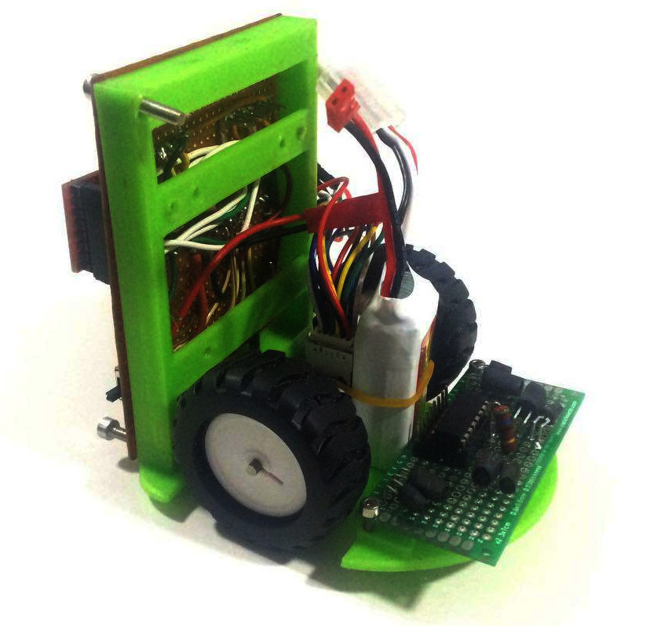

Nos daba tanta pena de corazón ver lo mal que quedaba lo que habíamos hecho
ayer que nos estuvimos planteando seriamente volver a hacer el circuito en
una placa completa, algo más ordenado, pensando en la colocación de las
motores para hacer un robot algo más decente.

Lo que habíamos hecho con los sensores nos fue bien: definir el circuito
en KiCad y ordenar el ruteo de los cables en el ordenador. Así que hicimos
el esquema y empezamos a probar cosas. Nos costó bastante encontrar una disposición
buena para los elementos, teniendo en cuenta el espacio necesario para los motores
y los zócalos del arduino y el puente H. Desistimos. Aunque dejamos lo hecho en
el commit. Quizá en el futuro nos animemos de nuevo.

# Otro chasis

Aprendiendo de los errores de ayer, vamos a hacer un chasis mucho más corto,
en el que la placa de sensores está prácticamente pegada a las ruedas por delante,
la batería irá en vertical, apoyada en los motores (quizá la tengamos que sujetar con una goma),
y la placa que tenemos actualmente (que definitivamente resoldaremos algún día, cuando
tengamos ganas) irá en la parte de atrás _en vertical_). Con eso queda un chasis bastante más corto
(sobre 88 cm). Estamos escribiendo esto mientras imprime, así que ya se veremos
si las ideas que tuvimos son buenas.

# Resultado

Al final queda así:

No es tan malo como parece. Ha quedado bastante compacto, corto, y lo más estrecho
que podemos conseguir con estos motores (sin considerar  algún tipo de transmisión
que nos permita ponerlos uno al lado del otro.

Por supuesto, el circuito de "atrás" pesa demasiado y el centro de gravedad está
completamente retrasado. No nos va a quedar otro remedio que rehacerlo en una
placa más pequeña. Realmente tenemos espacio, no se muy bien qué estábamos
pensando cuando empezamos a soldar el arduino en esa placa tan grande.

commit: 2512cc7eebeaf9c3e6f3bf21db87e8889bd3f615

