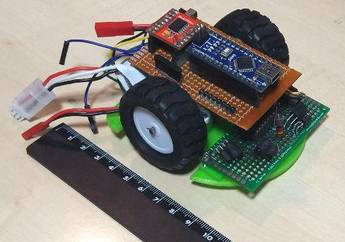

Continuamos dándole una vuelta más al diseño. En vez de resoldar todo en una
nueva baquelita, lo que hicimos fue cortar la que teníamos, ya que estaba un montón
de espacio desaprovechado y prácticamente todas las soldaduras se agrupaban
en la hilera arduino/puente H.

Tuvimos que mover el interruptor y las resistencias, y resoldar algún cable
más que incordiaba, pero ha quedado lo suficientemente estrecha para que
quepa encima de los motores, entre las ruedas, dejando espacio atrás para
la batería.

Como estas cosas nos llevan un montón de tiempo, ni siquiera hemos comprobado
 las soldaduras nuevas, ni hemos unido la placa "base" con la de los sensores. Pero
estéticamente la cosa ha mejorado mucho.

Está todo sin sujetar, para entender la idea. No está claro cómo apoyaremos la placa
 base en los motores, ni cómo se sujetara la batería.

También hay margen para redondear las esquinas en la placa de sensores,
igualando a la base de plástico. Aún hay mucho que hacer pero comparado con lo
de antes de ayer estamos contentos.
