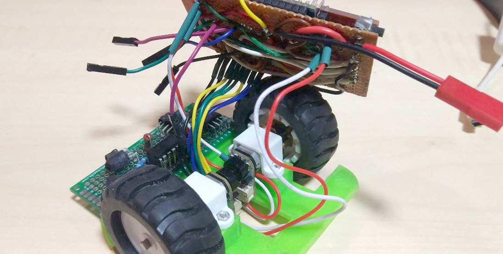

Para colocar la nueva placa hemos decidido prescindir de los terminales
Dupont que teníamos para conectar los motores, tanto los encoders como
los propios cables que les dan corriente. Ocupaban demasiado espacio y,
ya puestos a tener que recortar los cables (estaban con el largo "de fábrica")
decidimos soldarlos a la placa y fijarlos con tubo termoretráctil.

También hemos sacado los pines para la placa de sensores. Ahí sí que hemos puesto
los Dupont. Nos falta alguna cosa más pero vamos probando todo poco a poco, que
no queremos llevarnos una sorpresa al final. Todo el circuito esta bastante cargado
y no es difícil soldar en un espacio tan pequeño.

Por hoy lo dejamos así:

