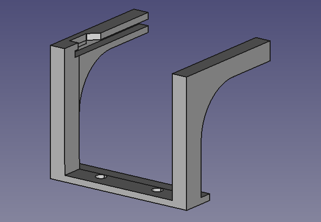
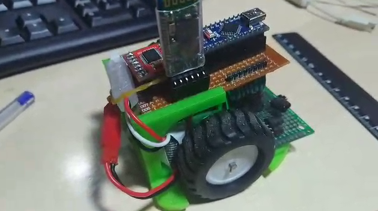

No fuimos capaces de fijar la baquelita superior al chasis. Encontramos una
manera que implicaba taladrar la placa de sensores, el chasis de plástico
y la misma baquelita, y uniendo todo con unos tornillos y unos separadores.
Ya puestos a hacer una chapuza semejante decidimos hacer otra, pero menos
intrusiva (será la última?)

La idea es atornillar esto en la parte trasera, dejando un hueco para la
batería y un carril en el que la placa superior esté encajada en unos
raíles.

Nos ha quedado así:

Esta pieza la hemos diseñado sin un plan específico, tomando medidas sobre la
marcha (otra "prueba de concepto"). Realmente no nos gustaba que quedara todo
tan alto pero no queremos dedicarle más tiempo al diseño, y empezar de una
vez con la programación de sensores. De hecho se nos olvidó el pequeño hueco
para que encajara el interruptor (lo hemos añadido después de imprimir).

Una vez montado todo, hemos tenido que cambiar algún pin en los defines, y
hemos vuelto a activar el control de batería. Eliminamos además el entorno
de compilación para el arduino UNO.

# Lista de fallos físicos

Una vez listo todo, el robot presenta los siguientes problemas:

- La parte inferior del chasis está muy alto. Se deberían subir los soportes de
los motores mínimo un par de milímetros.
- El centro de gravedad está muy alto. Sorprendentemente, el centro está muy alto
pero justo encima de las ruedas. El robot parado se mantiene en equilibrio como
un balancín. Pero al ser el centro tal alto y haber tanta distancia de la base
del chasis al suelo, las arrancadas y frenadas golpean en sus respectivos extremos,
y con bastante momento angular.
- No tenemos bola loca, así que improvisamos una brida que por lo menos ofrece
un único punto de apoyo en los balanceos. Lo ideal sería tener un saliente redondeado en la
parte inferior cubrirlo con cinta de teflón, pero tampoco hay que afinar tanto con todo lo
demás como está.

# Prueba de trayectoria

Afinamos un poco más el radio de las ruedas. Cubrimos una distancia de 1 m prácticamente
con un 1mm de desviación con el radio a 0.021692 en vez de los 0.22 iniciales. Para
hacer los giros en redondo, ajustamos el radio a 0.067753 (frente a los 0.07 que nos da
el calibre de centro a centro de las ruedas).

Se nos acabó la batería durante estos ajustes y, al cargarlo, tuvimos que bajar el radio
a 0.0666... Tendremos que volver sobre esto, pero inicialmente no se nos ocurre dónde puede
estar el problema.

El robot hace ahora la trayectoria del [post del 7 de febrero](https://recunchomaker.github.io/adefesio/terminologia-acciones-y-secuencias/)
bastante bien. Al cabo de 7 u 8 veces acaba tirando una pared, pero creemos que está
bastante bien dadas las circunstancias.

