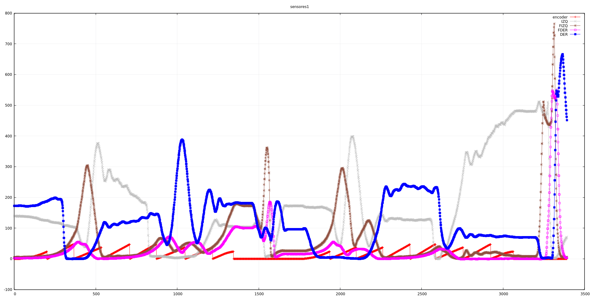

Con el robot conectado al USB movemos un obstáculo por delante para ver la respuesta
de los sensores. Salta a primera vista que, a la misma distancia, una lectura en un
sensor es muy diferente de la otra. En una primera fase intentaremos ajustar la
ángulo del diodo/receptor para maximizar la lectura.

Con unas pinzas, vamos ajustando empujando manualmente las parejas, intentando
que estén paralelos al suelo y paralelos entre ellos (mejor incluso un poco convergentes
en un punto lejano. Nos damos cuenta que los hemos puesto
demasiado cercanos uno del otro en la placa, con lo cual tampoco tenemos mucho juego. Si lo
hubiéramos diseñado de nuevo, quizás hubiera sido mejor dejar un pad en el medio, o
incluso ponerlos uno encima del otro. Ahora no lo vamos a cambiar, así que maximizamos
la lectura, consiguiendo alrededor de 700 en cada sensor (un 70% del rango dinámico, con
lo cual nos damos por satisfechos.

# Lecturas en el laberinto

Ponemos el robot en el laberinto, y miramos las lecturas en distintos sitios, para hacer
un poco de brainstorming. Unas primeras ideas:

- El robot centrado entre dos paredes laterales devuelve una lectura de unos 150-180 en
ambos diodos laterales
- Se empieza a detectar una pared frontal un par de casillas antes, aunque dada la respuesta
de tipo exponencial, el incremento es pequeño. De todos modos, justo cuando se entra en una
casilla con una pared enfrente la lectura es significativamente buena, de unos 30-40.

# Lecturas en una trayectoria

Esta es la lectura de los distintos sensores siguiendo la trayectoria de anteriores posts
en el laberinto de madera.

La lectura de sensores nos parece bastante buena dentro de lo que cabe. El robot ha acabado
algo desviado a la derecha, respecto a su posición inicial, y por eso esas lecuras muy altas
al final del recorrido, primero del sensor izquierdo, y luego del derecho, al acabar de hacer
el giro en redondo.

commit: c25da88664ba758c944e481f21340388be823756
