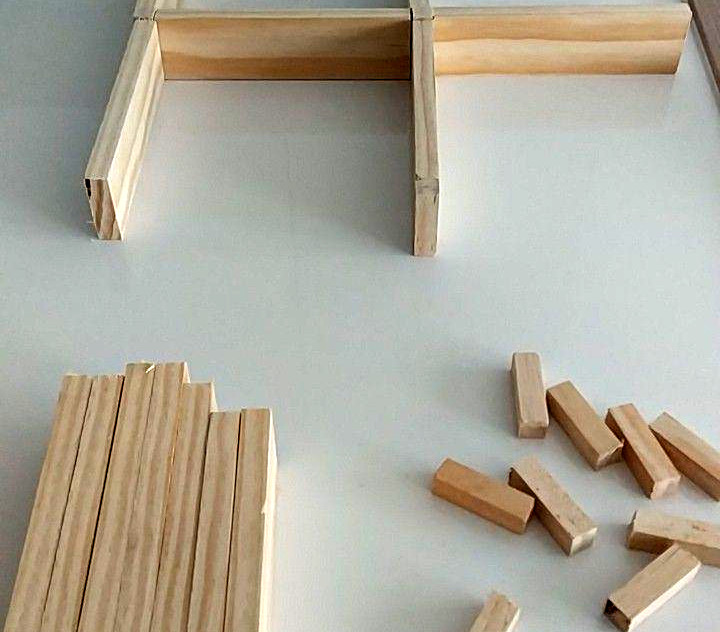
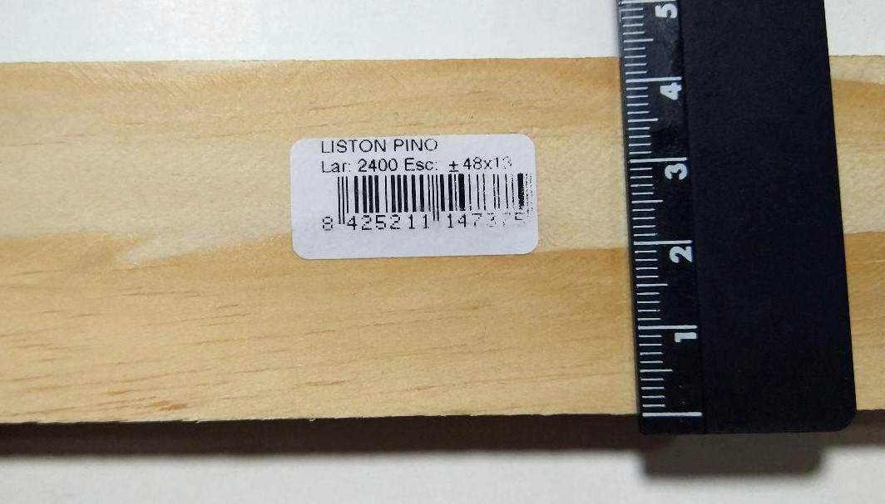

Hoy hemos ido a comprar un listón de 2400x48x13 para las paredes, y otro de 2400x13x13 para
las viguetas. Cada listón de 2400 nos daría para 14 paredes, y con uno de los de 13x13 tenemos
viguetas de sobra para un laberinto grande. No hemos sido capaces de encontrar en ningún sitio
listones de 12, pero puestos a elejir, mejor uno más restrictivo que el anterior que encontrábamos
que era de 9mm. Supone medio milímetro de diferencia en cada lado, así que el robot debería 
ser capaz de superar eso.

Entre preparar el taller y empezar a cortar hemos tardado bastante asi que no hay mucho más que
contar. Hecho un corte correcto, los demás se hacen enseguida pero en el primero siempre hay que
afinar.

Tristemente, cuando ya era demasiado tarde, nos dimos cuenta que el listón no es de 48 sino
de 44mm de alto. Hay un error en la referencia de la tienda. No voy a decir el nombre, pero
empieza por brico y acaba por mart. Que sepáis que esos listones tienen la medida mal etiquetada.

