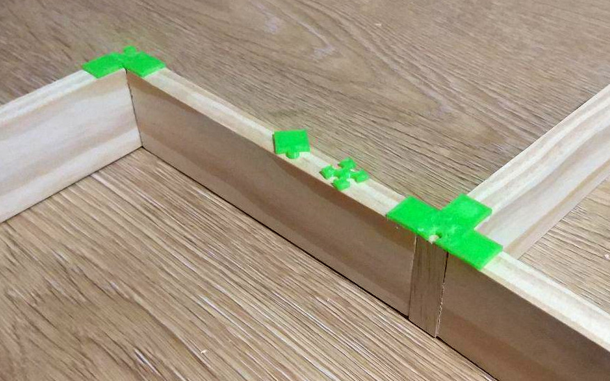

Para que encajen las viguetas con las paredes hacemos dos piezas que encajen como
un puzle y que se pegan a la parte superior de la vigueta (huecos) y a los laterales
superiores de las paredes.

Nosotros no vamos a tener (por ahora) el laberinto fijo en un tablón, con las viguetas
atornilladas o pegadas al suelo, así que intentaremos que de alguna manera las piezas "escuadren" y sea relativamente
fácil de cambiar la configuración. Resulta que el pegamento normal de contacto pega decentemente
el pla a la madera, así que vamos a ver cómo va.

El fichero de FreeCAD 'encajes-pared-viga-2.fcstd' contiene el diseño de ambas piezas. En la
hoja de cálculo asociada están los parámetros que se utilizaron. Es importante jugar con estos
parmámetros imprimiendo sólo una pieza de cada, para dar con la combinación que mejor se ajusta
a la configuración de la impresora 3d.

commit: 1e9f65444a0ce0bb6b0b4e56f856810f0c1ccb80
