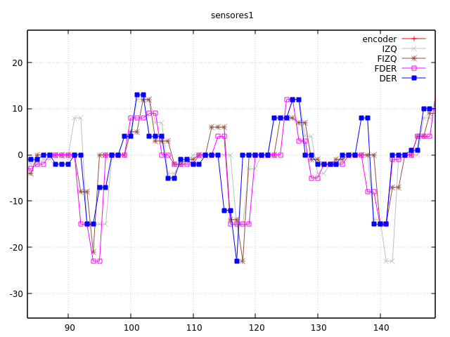
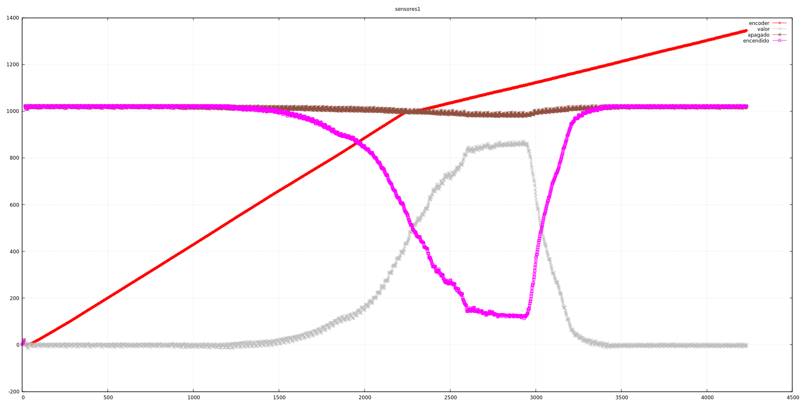

El código de hoy es prácticamente todo para tirar, aunque quedará en la posteridad
para en el commit y quizá algún día se aproveche algo.

Queríamos empezar a mapear el laberinto en nuestro array, con los valores devueltos
en los sensores. Inicialmente, sólo hacer que el robot siguiera un camino recto
entre pasillos (cuatro o cinco casillas) y mapeara correctamente las paredes
laterales, frenando en el centro cuando se encuentra la pared.

El robot terminaba chocando fuertemente contra la pared frontal. Hemos intentado
poner un margen ad-hoc en la detección de paredes pero era todo un desastre. Hemos
hecho muchas pruebas y cambios, hasta que dimos con este problema:

Este error permaneció indetectado cuando "calibramos" (es un decir, volveremos a esto más
adelante). Porque esta periodicidad en las lecturas aparece sólo cuando los motores están en marcha.
Hemos probado de todo, y en el commit de hoy está eliminado todos los controles: simplemente
se leen los sensores y se establece un pwm. El ruido sigue apareciendo.

Suponemos que es un problema eléctrico, pero no entendemos porqué la periodicidad es independiente
del valor del pwm. Además, no depende (al menos no completamente) del ruido que pueda entrar
en la alimentación de los leds, sino que aparece en la entrada analógica del arduino (podemos apreciarlo
incluso son activar los leds, manteniendolos apagados). Sin duda, tendremos que consultarlo con la almohada.

# Espera para medir el valor apagado

Estuvimos logeando varias variables, e introducimos algunos procedimientos (sólo para esta depuración)
para poder recuperar las lecturas con un diodo encendido y apagado. Ha aparecido un error bastante
grave: no estábamos esperando lo suficiente para leer el sensor después de apagarlo. Esto hacía que
los valores tuvieran poco margen, y unido al ruido anterior, la lectura final era un desastre.

Hemos aumentado el tiempo de espera, de manera que al acercarse a una pared, el valor leido en la
lectura cuando el diodo esté apagado apenas varíe. 

La línea marrón (se aprecia el rizo debido al ruido del que hablábamos antes) es el valor leído en
el sensor después de esperar 275 ms. Nos parece un tiempo de espera exagerado: o encontramos la manera
de dedicarlo a otras tareas o nos fiamos simplemente del valor _rosa_ de la gráfica, que es el valor
directo de la lectura. El problema es que el arduino, en este tiempo de espera, se puede perder
pasos de encoder.

Quizá deberíamos mantener los diodos apagados y en la interrupción leer, encender, esperar y leer: a
lo mejor es menor el tiempo en el que los leds se ponen a tope de intensidad que el tiempo que tardan
en apagarase (parece lógico). Además, estaríamos reduciendo el ciclo de trabajo con led encendido y
podríamos disminuir la resistencia limitadora para aumentar su intensidad. Habrá que hacer muchas
más pruebas.
