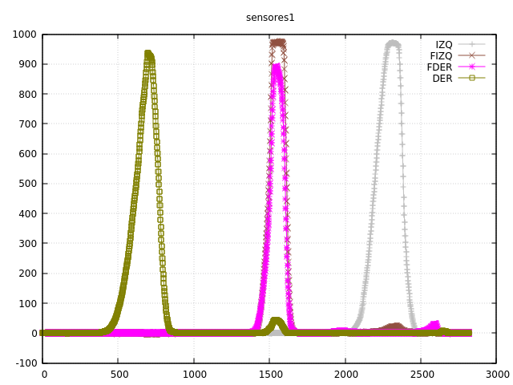

El problema de ayer no era tal. Pero al menos nos ha servido para replantear
algunas partes del código y encontrar una manera mejor de controlar los sensores.

Efectivamente, hicimos unas pruebas y compensa claramente mantener los diodos
normalmente apagados, y en cada salto de interrupción leer el sensor (será la
lectura 0), encender el diodo y esperar sólo 50 ms (seguramente se pueda afinar
pero tampoco le damos importancia por ahora) y leer el resultado para hacer la resta.

El margen dinámico ahora está cercano a los 1000 (no como anteriormente, que estábamos
capturando lo que creíamos "ruído infrarrojo" lo que realmente eran los últimos coletazos
del led encendido).

Ahora que ya sabemos algo más de cómo se tendría que comportar en el laberinto, vemos que el alcance
en los diodos frontales se nos queda un poco justo. Exploraremos despacio para compensarlo, 
pero creemos que podemos aumentar la resistencia en la entrada del sensor (para hacer menos
sensible el transistor) al mismo tiempo que disminuimos la del diodo, aumentando su intensidad. Pero cualquier cambio
en la placa, ahora mismo, nos da muchísima pereza.

Y respecto al ruido... el problema estaba en la alimentación por USB. Al hacer las pruebas
con batería y logeando por bluetooth, el ruido desapareció.
