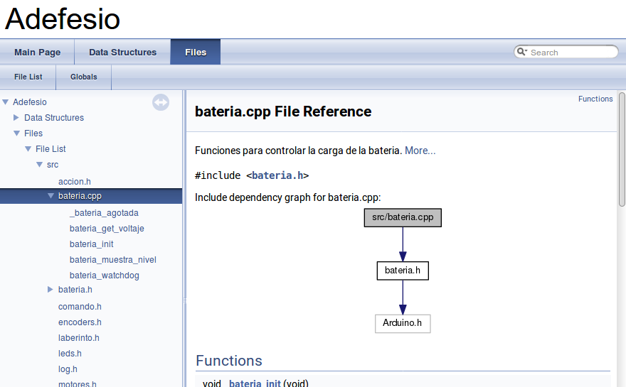

Hemos visto en el código de [bulebule](https://github.com/Bulebots/bulebule) que
los comentarios tienen un formato especial:

```cpp
/**
 * @brief Run a full linear profile test.
 *
 * The robot will accelerate and maintain the target speed for 0.5 m and then
 * decelerate back to zero speed. There is no angular speed in this test, only
 * linear movement. During all this test information about the relevant linear
 * speed variables is logged periodically for later analysis.
 */
void run_linear_speed_profile(void)
{
	int32_t start_micrometers;
```

Esto se hace para poder generar de forma automática documentación en varios formatos (html, latex). 
Vamos a utilizar [Doxygen](http://www.doxygen.nl/) para esto.

# Instalación y configuración

Los repositorios oficiales de Ubuntu está disponible esta herramienta, así que vamos a instalarla
con `sudo apt install doxygen`.

Lo siguiente es crear un pequeño archivo de configuración:

```
~/git/adefesio_master$ [master %>] doxygen -g

Configuration file `Doxyfile' created.

Now edit the configuration file and enter

  doxygen Doxyfile

to generate the documentation for your project

~/git/adefesio_master$ [master %>]
```

Guardamos el fichero original, por si acaso, y editamos el archivo `Doxyfile`, modificando unas pocas líneas.

```
~/git/adefesio_master$ [master *%>] diff Doxyfile Doxyfile.orig
35c35
< PROJECT_NAME           = "Adefesio"
---
> PROJECT_NAME           = "My Project"
61c61
< OUTPUT_DIRECTORY       = docs
---
> OUTPUT_DIRECTORY       =
245c245
< OPTIMIZE_OUTPUT_FOR_C  = YES
---
> OPTIMIZE_OUTPUT_FOR_C  = NO
437c437
< EXTRACT_STATIC         = YES
---
> EXTRACT_STATIC         = NO
774c774
< INPUT                  = src
---
> INPUT                  =
1419c1419
< GENERATE_TREEVIEW      = YES
---
> GENERATE_TREEVIEW      = NO
1607c1607
< GENERATE_LATEX         = NO
---
> GENERATE_LATEX         = YES
```

- Declaramos el nombre del proyecto
- Especificamos el directorio donde se generará la documentación
- Optimizamos la salida para el lenguaje C
- Le decimos que se muestren las variables estáticas (por defecto no lo hace, y en nuestro proyecto son clave)
- Especificamos la carpeta en la que se encuentra el código fuente
- Configuramos la salida en forma de árbol, que nos gusta bastante
- Configuramos que no genere la salida en LaTex

Una vez echo esto, se genera la documentación simplemente con `doxygen`.

# Primer fichero

Como prueba, vamos a documentar algo sencillo, los fuentes de `bateria.cpp` y `bateria.h`, que no parece que vayan a cambiar mucho.
Después de ejecutar el comando `doxygen`, la documentación generada aparece así:



Nos gusta como queda. En sucesivos días iremos compaginando la limpieza y documentación del código, procurando no introducir ninguna funcionalidad más.

commit: d4aea5754e183275603fa900b746744a6bcc5b77
