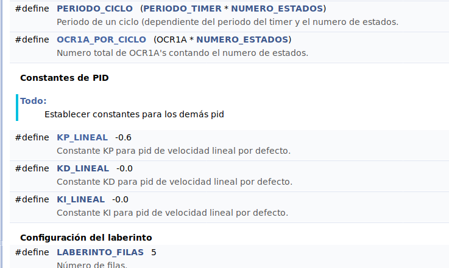

Seguimos comentando el código para la generación de la documentación
con Doxygen. Continuamos con un par de ficheros fáciles, el de _settings_
y el de _comando_

# Agrupar variables en Doxigen

Una cosa que nos ha gustado a la hora formatear los comentarios para
_Doxygen_, es que podemos agrupar variables o funciones por cualquier criterio arbitrario que definamos, y luego aparecen en la documentación perfectamente clasificadas.

```cpp
//@{
/**
 * @name Características físicas del robot
 */

/// Radio de las ruedas motrices, en metros
#define RADIO_RUEDAS 0.021692

/// Distancia entre las ruedas, en metros
#define DISTANCIA_ENTRE_RUEDAS (0.063753)
//@}
```

# Lista de TODO

Doxygen también permite añadir etiquetas _@todo_ para documentar tareas
pendientes de hacer, y luego se muestran unificadas en una única página. Vamos
a utilizar esto como un control de _issues_ local. Así es cómo va quedando todo



# Poner commit como clickeable en las entradas de este post

Siguiendo con pequeños detalles, decidimos añadir un parámetro _commit_ a cada
post en los ficheros de jekyll, y en vez de escribirlo este commit simplemente en "modo texto", poder generar la url directa a la
consulta de dicho commit en github. Simplemente cambiamos el fichero `post.html` y ponemos el commit al final.

Ahora, pinchando aquí abajo, podenos navegar en el repositorio de github en la versión
que estaba en este mismo post.
