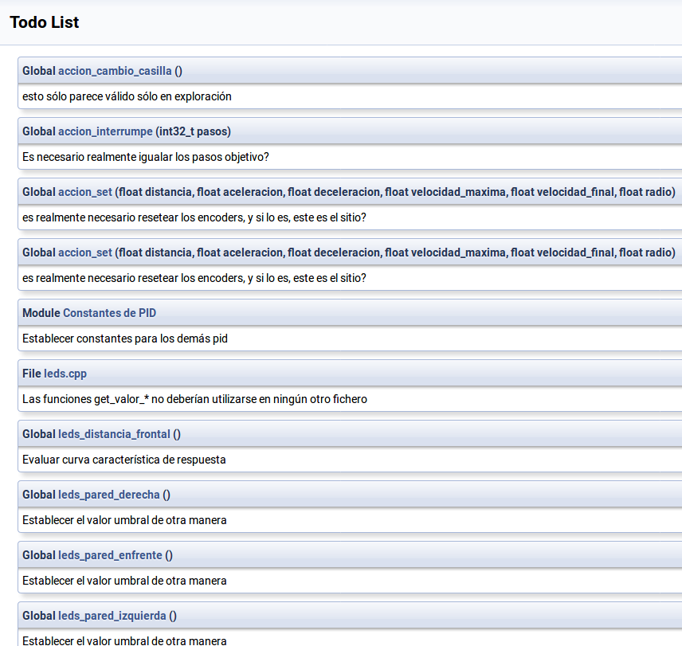

Hoy no hay mucho nuevo. Simplemente documentar estos dos ficheros, y
aprovechamos para eliminar algunas funciones no usadas.

La lista de TODO's empieza a ser larga, pero no impiden que con estos commits
que estamos haciendo el robot circule correctamente, siguiendo la pared derecha

