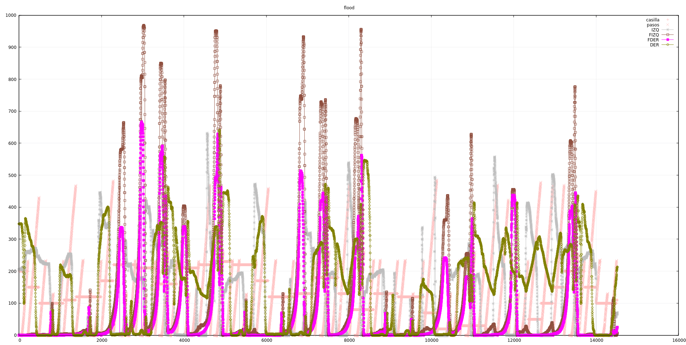
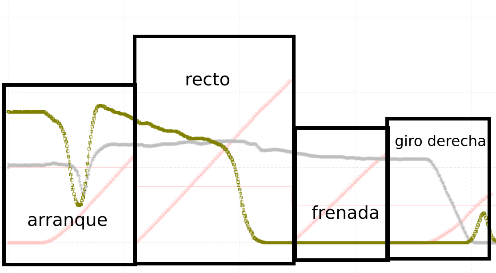

Ayer quedamos algo escarmentados, y nos convencimos de que es mejor controlar bien
el movimiento del robot antes de meterse en más complicaciones. Así que lanzamos
el robot por el laberinto y logeamos los valores de los sensores y sus casillas,
a ver si tenemos una visión general de lo que pasa.

Para ello creamos una nueva función en `logs.cpp` y limpiamos un poco otros logs
innecesarios por ahora. La nueva función `log_casilla_pasos_leds()` está
prefijada con '#1' para poder hacer grep del resultado.

Hay muchísima información aquí.

# Primeras conclusiones

Vamos a poner algunas ideas que vamos viendo haciendo zoom en el gráfico:

Las etapas se distinguen por la línea rosa, que indica los pasos recorridos.
En los arranques y frenadas, esta línea pasa algo de 200 pasos, correspondientes
a 9 cm. En las casillas en las que el robot continuó recto, esta línea pasa de
400, y las demás se corresponden con giros en redondo.

Por claridad, sólo se muestran aquí los sensores izquierdo y derecho.

- Esa caída de los sensores en el arranque (aunque hay paredes en esa casilla),
se corresponden con que no hay viguetas entre esas paredes (por vagancia). Se
ve que el robot es sensible a eso aunque no le afecta.
- En la segunda casilla, que el robot avanza recto, el sensor derecho cada vez
se aleja más de la pared, y no parece que el pid esté corrigiéndolo. Será lo
primero que miremos.
- La siguiente acción es la de frenada y parece que todo va bien. De todos modos
el valor del único sensor con información va disminuyendo y tampoco hacemos nada por
evitarlo. Será lo segundo que intentaremos corregir.
- En el giro derecha, inicialmente el robot tiene una pared lateral a la izquierda.
Se ve claramente cómo al girar esa pared va desapareciendo y se produce un pequeño
pico en el otro sensor que se corresponde con la vigueta que empieza a aparecer
a su derecha y desaparece cuando el giro es completo. Quizá se pueda utilizar
este pico para corregir pequeños desvíos en el giro.

Dejamos en el commit de master el fichero de datos obtenidos, para futuras referencias.

