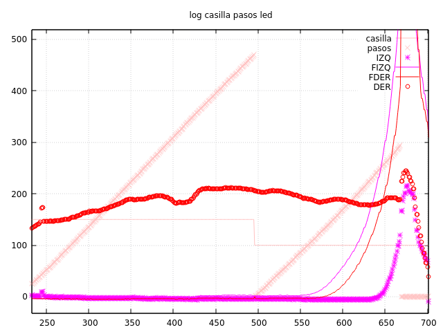
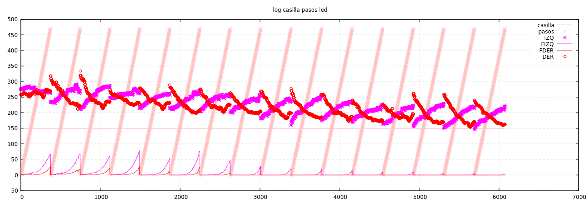

Hacemos un pequeño script que sea capaz de dividir los logs por acciones, y así
poder evaluar acciones independientes. Por ahora sólo interpreta los logs tipo
'#1', de la función `log_casilla_pasos_led()`, pero si vemos que este es un buen
camino, interpretará distintos tipos de logs.

# Diferencia en los valores de los sensores

Después de varias pruebas, aunque el control de desvío lateral parece importante,
tenemos un problema grave que aparece porque los sensores no devuelven siempre
el mismo valor a la misma distancia. No entendemos por qué pero la diferencia
puede ser importante. Se aprecia fácilmente al inicio, en la casilla original
con dos paredes laterales (y una por detrás). Unas veces los sensores devuelven
un valor entre 200-250, y otras entre 100-150.

Aparte del problema que esto supone en la corrección lateral (intentaremos introducir
una pequeña calibración más adelante), cuando entramos en una casilla a veces el robot
no detecta la pared frontal, con lo cual, en `robot.cpp`:  lanza la acción RECTO

```cpp
...
} else if (!leds_pared_enfrente()) {
     accion_ejecuta(RECTO);
...
```

Esta acción se acaba cancelando en este control chapuzero:
```cpp
    if ((leds_get_valor(LED_FDER) + leds_get_valor(LED_FIZQ) > 1000) and accion_get_radio() == RADIO_INFINITO) {
        Serial.println(F("chocamos! leds:"));
        accion_interrumpe(pasos_recorridos);
    }
```

y salta a la vista que no es demasiado elegante.

# Problema eléctrico? Conflicto en intererupciones?

Hacemos un laberinto simple de 3x1, completamente cerrado y lanzamos el robot logeando
con ```log_casilla_pasos_led()```



No han hecho falta muchas repeticiones: a la primera el robot ha chocado al final de nuestro pequeño pasillo. Se ve
claramente que cuando termina la segunda casilla (la pendiente que indica el número de pasos de encoder llega a 470)
los sensores frontales no detectan la pared que hay al final de la siguiente.

Hicimos un montón de pruebas de nuevo con el intervalo de tiempo con el sensor encendido, incluso hemos cambiado
la actualización de los sensores para en cada interrupción sólo se actualize uno de los valores. pero lo que acabó por
confundirnos es que, en un momento que los sensores devolvían en las paredes laterales valores muy pequeños (por
debajo de 100), después de un reset volvían a aparecer cercanos a 300.

Ponemos una nueva chapuza en main para que nos avise si los sensores parecen estar funcionando mal:

```cpp
    while((leds_get_valor(LED_DER) < 200 and
        leds_get_valor(LED_IZQ) < 200)) {
            log_leds();
            while(timer1_get_cuenta() < 1000);
            timer1_reset_cuenta();
    }
```

Ponemos el robot en nuestro pasillo de 3x1, y efectivamente se para en el bucle anterior. Hacemos un reset y se lo salta.
Empieza a andar correctamente por el pasillo, gira, vuelve por el pasillo... y así sucesivamente.  Pero extrayendo las acciones 'recto' del log resultante, obtenemos esto:



Para que se entienda: cada diagonal se corresponde con una casilla, y en este gráfico aparece únicamente las acciones 'recto' de nuestro pasillo de 3x1. La primera vez, los sensores laterales devuelven unos valores entre 250 y 300, pero
se ve claramente como las siguientes veces que pasa por esa casilla (no aparecen en el gráfico, pero por supuesto el robot llega a la casilla final, gira 180 y vuelve a empezar) los valores de los sensores van decayendo.

Los picos que se ven en la parte inferior son las lecturas de los sensores frontales. La primera vez detectamos perfectamente la pared que va a aparecer al final
de la siguiente casilla, pero cada vez esta detección va empeorando y al final ya es imposible de detectar.

Nos quedamos sin ideas.


