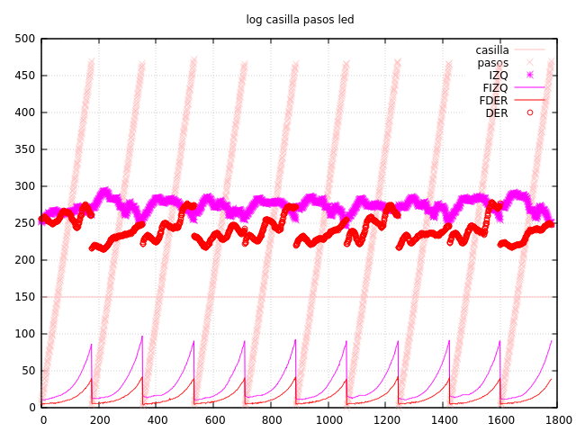

Aprovechando nuestro laberinto mínimo de 3x1, vamos a añadir un parámetro al control de
velocidad para centrarse cuando se esta entre pasillos. 

Establecemos una nueva constante KP_PASILLO en `settings.h`, y su correspondiente comando.
Añadimos además unos nuevas funciones en `robot.cpp` que devolverán el desvío al centro.
No queremos que `motores.cpp` sepa nada de la acción en ejecución, y `robot.cpp` puede
tener mucha información sobre la casilla actual y en el futuro devolver una corrección
de desvío más completa (en función de la posición del robot, las paredes actuales o de la
siguiente casilla... etc).

Después de algunas pruebas, encontramos que un valor para KP_PASILLO de 0.00012 parece
perfecto. Con 0.00013 se observa demasiado balanceo y con 0.00011 es un poco escasa.

Se ve que el robot va corrigiendo la trayectoria hasta igualar los sensores (estamos viendo
sólo las casillas rectas del laberinto de 3x1. Es una gozada ver ahora cómo se detecta la
pared frontal, casi incluso al principio de la casilla anterior. Esperemos que nos dure.
