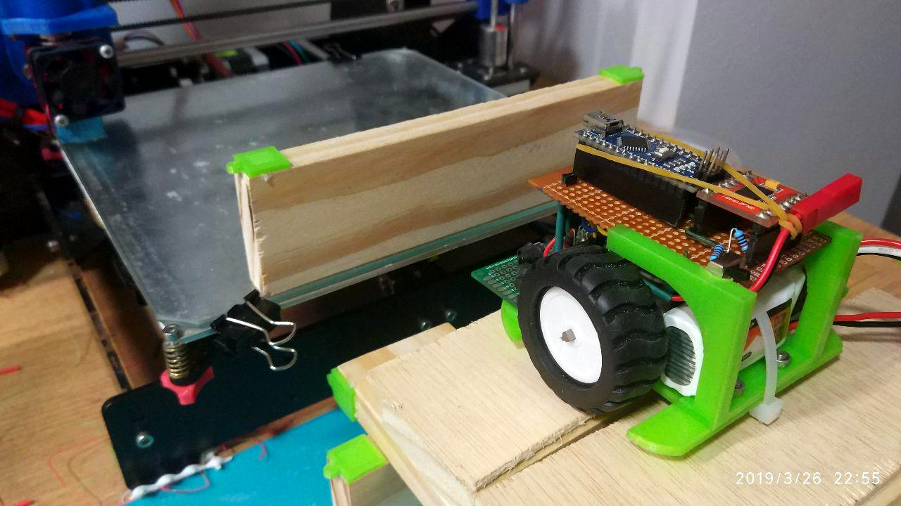
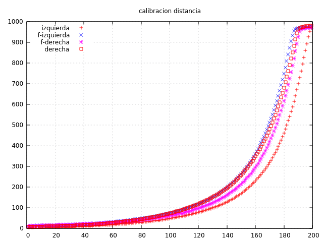
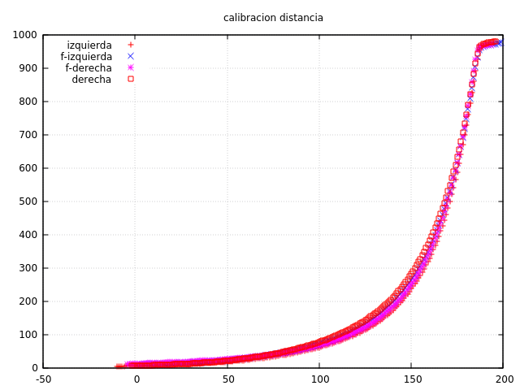
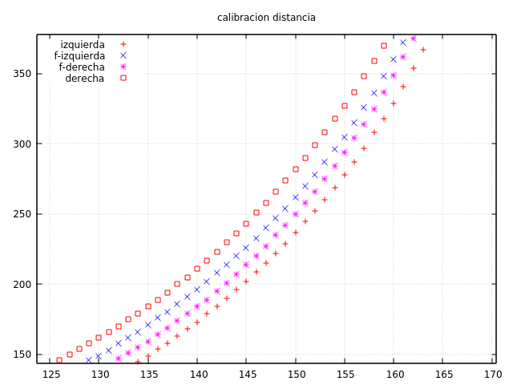

Para intentar averiguar el ángulo con el que estamos navegando por los pasillos,
debemos tener una manera de transformar las lecturas del sensor en distancias.
A ver si conseguimso hacerlo. 

Por el momento, ya conseguimos que el sensor frontal derecho nos devuelva una lectura
parecida al izquierdo. El problema era más simple de lo que pensábamos: simplemente, el
tubo termoretráctil estaba demasiado encogido en el sensor, dejando muy poca abertura.
Lo hemos cortado con cuidado con un cutter y hemos puesto otro. Ahora las diferencias
son bastante parecidas.

Necesitamos elaborar una curva característica de valor del ADC en función de la distancia.
Podríamos usar el propio robot para moverse milímetro a milímetro hacia una pared frontal,
logeando los valores, pero vemos dos inconvenientes:

- El robot es muy impreciso a pequeñas velocidades, y moverse 1 mm partiendo en parado sería prácticamente imposible.
- Con este sistema, tampoco podríamos calibrar los leds laterales.

# Utilizar la impresora 3D para calibrar los leds

Vamos a mantener el robot fijo en una posición y utilizar la cama de nuestra impresora 3D
para acercar las paredes una distancia conocida. Un programa en python se encarga de coordinar
el proceso y enviar por el puerto serie de la impresora un _gcode_ para mover la cama, leer el
valor de los sensores del robot por bluetooth, y repetir todo esto varias veces para calcular
una media.

El invento nos ha quedado así:

Queda puesto en el commit el script en python para coordinar la impresora con el robot. El
`main()` de este commit espera por el comando _go_ para empezar la lectura de sensores. Entre
cada lectura se espera 1 segundo para dar tiempo a la impresora a moverse y que la pared deje
de balancearse.

# Gráficos

Las lecturas han resultado bastante buenas. Hemos tenido que hacer la calibración tres veces,
una para ambos sensores frontales y otra para cada uno de los laterales (poniendo el robot
de lado). Hemos juntado las lecturas en un único fichero y el resultado es este:

Se ve que la lectura es bastante consistente. La curva parece desplazada de unos sensores a otros.
No tenemos claro si es por las propias características del sensor, o porque no hayamos colocado
exactamente el robot en el mismo sitio al iniciar la calibración. Pero desplazando
cada resultado horizontalmente podemos obtener esta gráfica.

Casi coinciden, aunque hay diferencias en la parte central. Si hacemos zoom ahí:

El eje X está en milímetros. Vemos que para un mismo valor (por ejemplo 200), la diferencia de
lectura de un sensor a otro es de unos 5mm. Parece mucho, pero nuestra idea es utilizar el diferencial
de lecturas de cada sensor para hayar el ángulo, y en ese cálculo no debería influir tanto. Ya lo
veremos.
