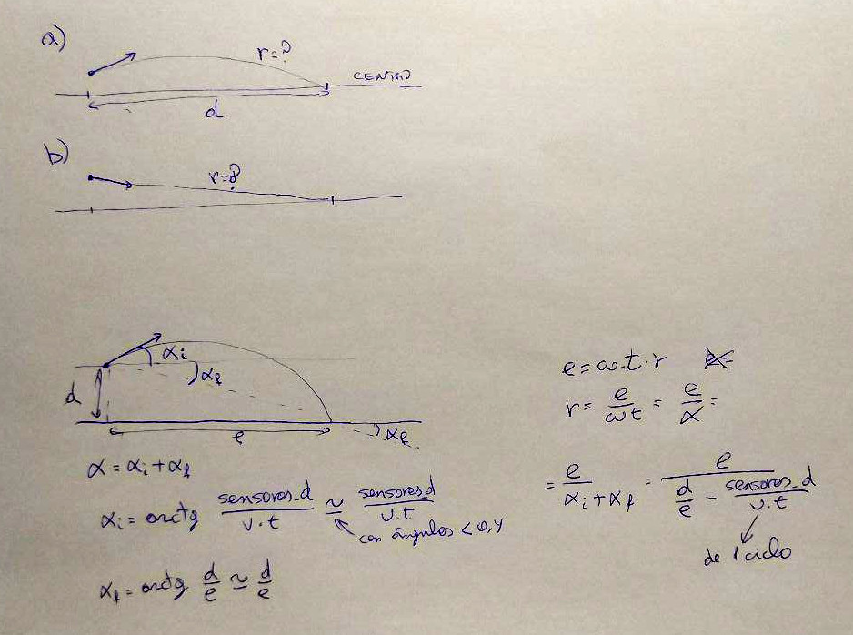

Ahora que tenemos una estimación de las distancias a las paredes, intentaremos
trazar la curva que nos devuelva a la línea central (en caso de desvío).

Por un lado, iremos guardando en la función 'leds_actualiza_valor()' el diferencial de una
lectura a otra de cada led. Esa diferencia se guardará en metros, y nos servirá para
calcular el ángulo con respecto a la línea central. En teoría, este diferencial dividido
por la distancia (sabemos la velocidad y el tiempo entre cálculos) nos dice la pendiente
 de la recta con el ángulo que nos interesa. Tendríamos que utilizar una arcotangente para
averiguar el ángulo, pero es una operación demasiado pesada y nos vamos a conformar con
el mismo valor diferencial/espacio, ya que la arcotangente es prácticamente la identidad en
ángulos pequeños.

Por otro lado, con las posiciones absolutas (y la anchura del robot) también seríamos capaces
de calcular el desplazamiento del robot con respecto al centro.

No tenemos demasiado claro cómo "incorporarnos" a la línea central en caso de desvío. Asi que
todo esto serán pruebas de concepto a ver si damos con algun método que de buen resultado.
Lo que se nos ha ocurrido es: con el desplazamiento del robot (perpendicular a la línea) y
el ángulo, tenemos un vector. Queremos una trayectoria que converga con la línea central en
un espacio _e_, así que debemos averiguar el radio de la circunferencia targente al vector
que corta en la línea central a esa distancia _e_.

Algo así:

No nos ha dado mucho tiempo a programar esto. Por el momento sólo tenemos la corrección
de ángulo (no la posición del robot). Pero no funciona muy bien: o nos hemos equivocado
en el dibujo o en la implementación.
