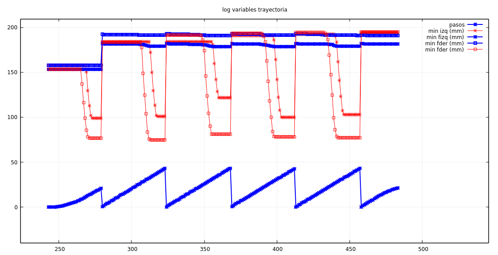

Tenemos varias cosas para probar la sincronización en los giros, y todas pasan
por tener un sistema que guarde los máximos valores de los leds (o sea, la mínima
distancia) durante los giros. También sera válido para corregir la trayectoria recta cuando
no hay paredes laterales.

Añadimos en `leds.cpp` los siguientes arrays:

```cpp
/// Valor minimo de distancia
volatile float leds_distancia_minima[4];

/// Pasos en los que se ha guardado la distancia minima;
volatile int16_t leds_pasos_distancia_minima[4];
```

Cuando pasamos de una casilla a otra, reseteamos las distancias mínimas (y los paso). Y en
la función de actualización de los leds añadimos la lógica para actualizar estas variables.
Para ver su comportamiento, también creamos su función en `logs` y su _plot_. Ponemos dos
filas de viguetas (simulando un pasillo sin referencias laterales) y ponemos el robot a
funcionar, creando en `camino_init` un camino de 5 pasos rectos. Veamos cómo se comportan
los leds laterales:



# Desfase de los leds laterales

Aparecen varios temas en este gráfico:

- Aunque hemos colocado el robot recto, se ve que siempre se activa un led antes que el otro.
Suponemos que es debido a la construcción física, a alguna pequeña variación en el ángulo con
el que el transistor recoge la luz.
- Las lecturas son algo grandes: la lectura sumada de ambas distancias son casi el tamaño
de la casilla. Si todo fuera perfecto, deberían ser igual a la anchura de la casilla menos
la del robot.
- Vemos ruido en el sensor frontal cuando se activan los laterales con las viguetas. No nos
habíamos fijado y probablemente habra que tener eso en cuenta para distinguir las distancias
a una pared frontal si tenemos o no paredes laterales.
- En una de las lecturas, el led izquierdo es más bajo que los demás. Afortunadamente no es
un problema. Simplemente esa vigueta estaba desplazada. Eso si, sólo lo estaba 1 cm, y la lectura
es casi 2 centímetros diferente.

Viendo el gráfico se nos ha ocurrido que podemos utilizar ese desfase para corregir mínimamente
la trayectoria en los pasillos "vacíos" (sin paredes laterales). Esta corrección sólo se producirá
cuando estamos en una casilla sin paredes y la anterior tampoco las tuvo (es en este caso cuando
tienen sentido los valores mínimos de las distancias).

Lo único que tenemos que hacer es añadir un control en `robot.cpp` de este estado (en el cambio
de casilla activamos una variable si los valores mínimos de los leds valen para la sincronización)
y la función `get_angulo_desvio()` devolverá un pequeño ángulo proporcional al desfase de pasos.
Introducimos una constante para contrarrestar esa diferencia que se produce aunque el robot vaya
perfectamente recto. Esto ha sido una cosa rápida, ya que lo que queremos hacer realmente es
sincronizar los giros. El caso es que funciona relativamente bien y el robot se corrige en el
pasillo (si el ángulo no es demasiado grande). Otro día añadiremos algo más matemáticamente
correcto teniendo en cuenta además la distancia a cada vigueta.
